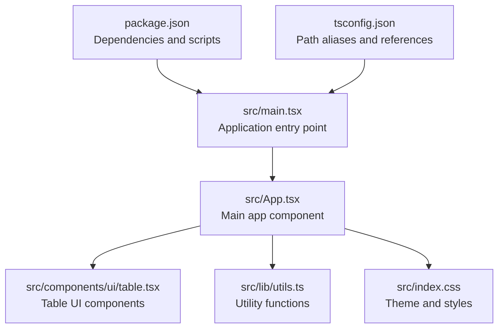
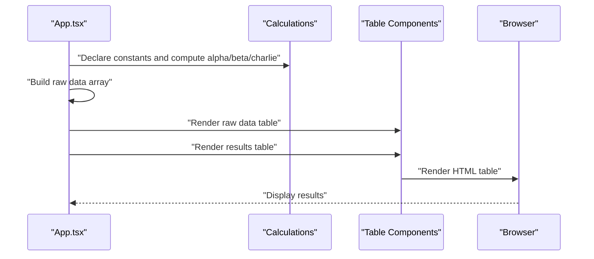
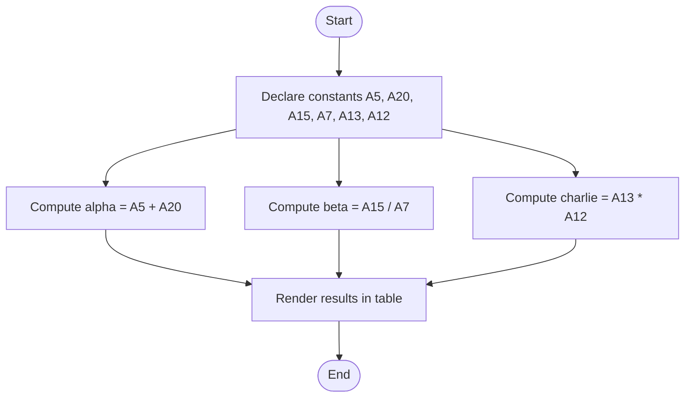
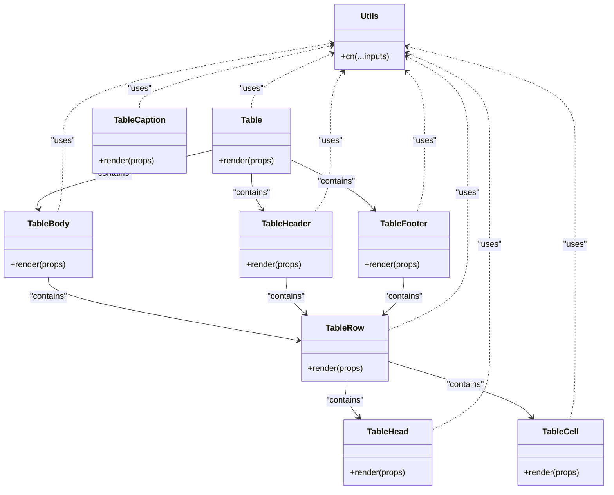
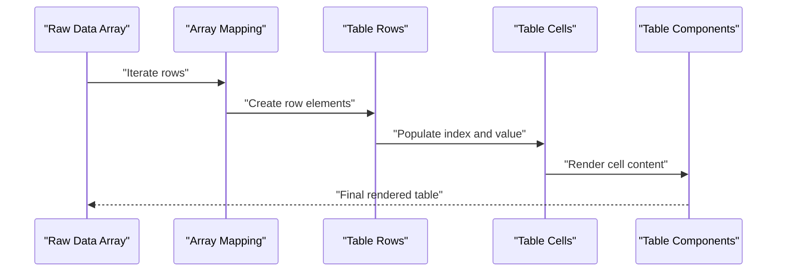
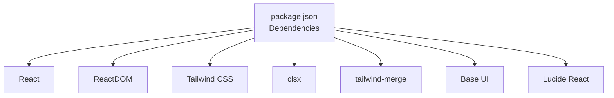

# Data Processing & Mathematical Calculations

<cite>
**Referenced Files in This Document**
- [src/App.tsx](file://src/App.tsx)
- [src/components/ui/table.tsx](file://src/components/ui/table.tsx)
- [src/lib/utils.ts](file://src/lib/utils.ts)
- [src/main.tsx](file://src/main.tsx)
- [src/index.css](file://src/index.css)
- [package.json](file://package.json)
- [tsconfig.json](file://tsconfig.json)
</cite>

## Table of Contents
1. [Introduction](#introduction)
2. [Project Structure](#project-structure)
3. [Core Components](#core-components)
4. [Architecture Overview](#architecture-overview)
5. [Detailed Component Analysis](#detailed-component-analysis)
6. [Dependency Analysis](#dependency-analysis)
7. [Performance Considerations](#performance-considerations)
8. [Troubleshooting Guide](#troubleshooting-guide)
9. [Conclusion](#conclusion)
10. [Appendices](#appendices)

## Introduction
This document explains the data processing and mathematical calculation system demonstrated in the table components. It focuses on how arithmetic operations are declared and computed (alpha addition, beta division, and charlie multiplication), how raw data arrays are structured and rendered, and how the calculation results are integrated into the UI. It also documents the TypeScript interfaces for data objects, error handling considerations for mathematical operations, and best practices for maintaining data integrity and adapting the system for different data sources and business logic.

## Project Structure
The application is a React + TypeScript + Vite project with a minimal UI framework. The calculation logic and rendering are centralized in the main application component, while reusable UI table components are provided under a dedicated module.

**Diagram sources**
- [src/main.tsx:1-11](file://src/main.tsx#L1-L11)
- [src/App.tsx:1-102](file://src/App.tsx#L1-L102)
- [src/components/ui/table.tsx:1-133](file://src/components/ui/table.tsx#L1-L133)
- [src/lib/utils.ts:1-7](file://src/lib/utils.ts#L1-L7)
- [src/index.css:1-40](file://src/index.css#L1-L40)
- [package.json:1-40](file://package.json#L1-L40)
- [tsconfig.json:1-19](file://tsconfig.json#L1-L19)

**Section sources**
- [src/main.tsx:1-11](file://src/main.tsx#L1-L11)
- [src/App.tsx:1-102](file://src/App.tsx#L1-L102)
- [package.json:1-40](file://package.json#L1-L40)
- [tsconfig.json:1-19](file://tsconfig.json#L1-L19)

## Core Components
- Calculation variables and constants:
  - Six scalar numeric constants are declared and used for computations.
  - Three derived results are computed: alpha (addition), beta (division), and charlie (multiplication).
- Data arrays:
  - A raw dataset array is constructed with index-value pairs.
  - A results dataset array is constructed to display the computed values alongside their formulas.
- Rendering:
  - Two tables are rendered: one for raw data and another for calculated results.
  - The table components are composed from reusable UI primitives.

Key implementation references:
- Variable declarations and calculations: [src/App.tsx:13-22](file://src/App.tsx#L13-L22)
- Raw data array construction: [src/App.tsx:25-46](file://src/App.tsx#L25-L46)
- Calculated results array construction: [src/App.tsx:82-95](file://src/App.tsx#L82-L95)
- Table UI components: [src/components/ui/table.tsx:1-133](file://src/components/ui/table.tsx#L1-L133)

**Section sources**
- [src/App.tsx:13-22](file://src/App.tsx#L13-L22)
- [src/App.tsx:25-46](file://src/App.tsx#L25-L46)
- [src/App.tsx:82-95](file://src/App.tsx#L82-L95)
- [src/components/ui/table.tsx:1-133](file://src/components/ui/table.tsx#L1-L133)

## Architecture Overview
The system follows a straightforward data-to-render pipeline:
- Data preparation: Constants and arrays are defined in the main component.
- Computation: Arithmetic operations are performed to derive new values.
- Rendering: The UI renders two tables, one for raw data and one for computed results, using shared table components.

**Diagram sources**
- [src/App.tsx:13-22](file://src/App.tsx#L13-L22)
- [src/App.tsx:25-46](file://src/App.tsx#L25-L46)
- [src/App.tsx:82-95](file://src/App.tsx#L82-L95)
- [src/components/ui/table.tsx:1-133](file://src/components/ui/table.tsx#L1-L133)

## Detailed Component Analysis

### Data Model and Interfaces
The data model for rows in the tables is represented by a simple interface with two fields:
- index: A string identifier for the row.
- value: A numeric value associated with the row.

Interface definition:
- Row interface: [src/App.tsx:25-46](file://src/App.tsx#L25-L46)

Data structure management:
- Raw data array: [src/App.tsx:25-46](file://src/App.tsx#L25-L46)
- Results array: [src/App.tsx:82-95](file://src/App.tsx#L82-L95)

Complexity considerations:
- Array construction is O(n) where n is the number of rows.
- Access patterns are O(1) for individual elements.

Best practices:
- Keep identifiers unique and consistent.
- Validate numeric values before rendering to prevent unexpected UI behavior.

**Section sources**
- [src/App.tsx:25-46](file://src/App.tsx#L25-L46)
- [src/App.tsx:82-95](file://src/App.tsx#L82-L95)

### Calculation Logic
The calculation logic demonstrates three arithmetic operations:
- Alpha: Addition of two constants (A5 + A20).
- Beta: Division of two constants (A15 / A7).
- Charlie: Multiplication of two constants (A13 * A12).

Computation steps:
- Constants are declared and assigned values.
- Derived results are computed and stored in variables.
- The results are displayed in a dedicated table row.

**Diagram sources**
- [src/App.tsx:13-22](file://src/App.tsx#L13-L22)
- [src/App.tsx:82-95](file://src/App.tsx#L82-L95)

**Section sources**
- [src/App.tsx:13-22](file://src/App.tsx#L13-L22)
- [src/App.tsx:82-95](file://src/App.tsx#L82-L95)

### Table Rendering System
The table rendering system composes reusable UI components:
- Table container wrapper with responsive overflow.
- Header, body, footer, rows, cells, and captions.
- Utility function for merging Tailwind classes.

**Diagram sources**
- [src/components/ui/table.tsx:1-133](file://src/components/ui/table.tsx#L1-L133)
- [src/lib/utils.ts:1-7](file://src/lib/utils.ts#L1-L7)

Rendering integration:
- Raw data table: [src/App.tsx:52-69](file://src/App.tsx#L52-L69)
- Results table: [src/App.tsx:74-98](file://src/App.tsx#L74-L98)

**Section sources**
- [src/components/ui/table.tsx:1-133](file://src/components/ui/table.tsx#L1-L133)
- [src/lib/utils.ts:1-7](file://src/lib/utils.ts#L1-L7)
- [src/App.tsx:52-69](file://src/App.tsx#L52-L69)
- [src/App.tsx:74-98](file://src/App.tsx#L74-L98)

### Data Flow and Component Rendering
The data flow from raw arrays to rendered tables is straightforward:
- The main component defines constants and arrays.
- The arrays are mapped to table rows during rendering.
- The table components apply styling and accessibility attributes.

**Diagram sources**
- [src/App.tsx:25-46](file://src/App.tsx#L25-L46)
- [src/App.tsx:61-66](file://src/App.tsx#L61-L66)
- [src/App.tsx:82-95](file://src/App.tsx#L82-L95)
- [src/components/ui/table.tsx:1-133](file://src/components/ui/table.tsx#L1-L133)

**Section sources**
- [src/App.tsx:25-46](file://src/App.tsx#L25-L46)
- [src/App.tsx:61-66](file://src/App.tsx#L61-L66)
- [src/App.tsx:82-95](file://src/App.tsx#L82-L95)
- [src/components/ui/table.tsx:1-133](file://src/components/ui/table.tsx#L1-L133)

## Dependency Analysis
External dependencies and their roles:
- React and ReactDOM: Application runtime and rendering.
- Tailwind CSS and related packages: Styling and theme.
- clsx and tailwind-merge: Utility for merging class names.
- Base UI and Lucide React: Additional UI primitives and icons.

**Diagram sources**
- [package.json:12-20](file://package.json#L12-L20)

Internal dependencies:
- App.tsx depends on table components and utility functions.
- Table components depend on the utility function for class merging.

**Section sources**
- [package.json:12-20](file://package.json#L12-L20)
- [src/App.tsx:1-102](file://src/App.tsx#L1-L102)
- [src/components/ui/table.tsx:1-133](file://src/components/ui/table.tsx#L1-L133)
- [src/lib/utils.ts:1-7](file://src/lib/utils.ts#L1-L7)

## Performance Considerations
- Rendering cost: Rendering two small tables with a few rows is negligible.
- Array mapping: O(n) mapping over small datasets is efficient.
- Styling: Tailwind classes are merged at runtime; keep class lists concise.
- Recommendations:
  - For larger datasets, consider virtualization or pagination.
  - Memoize derived values if computation becomes expensive.
  - Avoid unnecessary re-renders by keeping state minimal.

[No sources needed since this section provides general guidance]

## Troubleshooting Guide
Common issues and resolutions:
- Division by zero:
  - Ensure divisor constants are non-zero before computing beta.
  - Add a guard condition to handle zero divisors gracefully.
- Type mismatches:
  - Verify that all values are numeric to prevent unexpected rendering.
  - Use explicit type checks or validation before rendering.
- Styling inconsistencies:
  - Confirm Tailwind theme variables are defined in the stylesheet.
  - Ensure the utility function for class merging is used consistently.

Error handling patterns:
- Guard against invalid operations (e.g., division by zero).
- Validate input arrays before mapping to rows.
- Provide fallback UI for missing or invalid data.

**Section sources**
- [src/App.tsx:13-22](file://src/App.tsx#L13-L22)
- [src/index.css:1-40](file://src/index.css#L1-L40)
- [src/lib/utils.ts:1-7](file://src/lib/utils.ts#L1-L7)

## Conclusion
The system demonstrates a clean separation between data preparation, computation, and rendering. The table components are reusable and styled consistently. By adhering to the outlined best practices—validating inputs, guarding against invalid operations, and keeping derived values memoized—the system can be extended to support diverse data sources and business logic while maintaining reliability and readability.

[No sources needed since this section summarizes without analyzing specific files]

## Appendices

### TypeScript Interfaces Reference
- Row interface:
  - Fields: index (string), value (number)
  - Usage: [src/App.tsx:25-46](file://src/App.tsx#L25-L46)

**Section sources**
- [src/App.tsx:25-46](file://src/App.tsx#L25-L46)

### Adapting the System for Different Data Sources and Business Logic
- Data sources:
  - Replace hardcoded constants with dynamic values from props or state.
  - Fetch arrays from APIs and transform them into the expected Row interface.
- Business logic:
  - Encapsulate calculations in pure functions for testability.
  - Introduce configuration objects to parameterize formulas.
- Rendering:
  - Extend table components to support additional columns or actions.
  - Use conditional rendering for different result categories.

[No sources needed since this section provides general guidance]