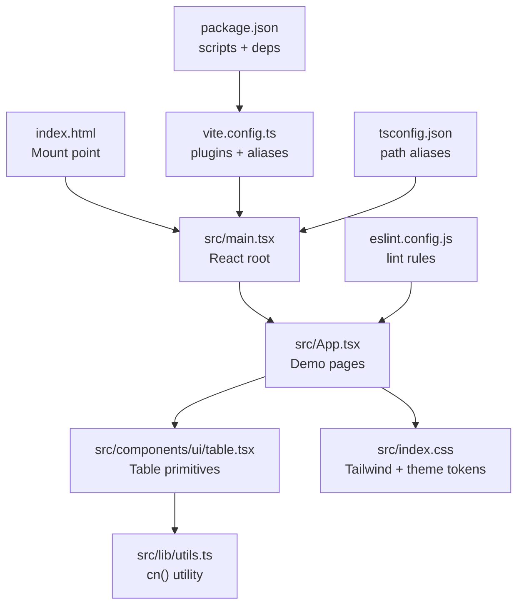
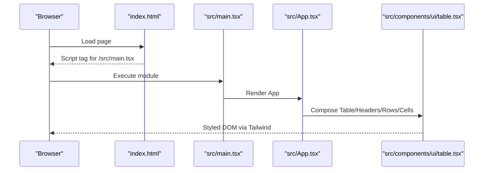
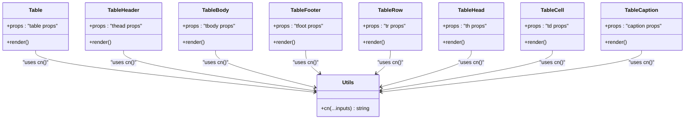
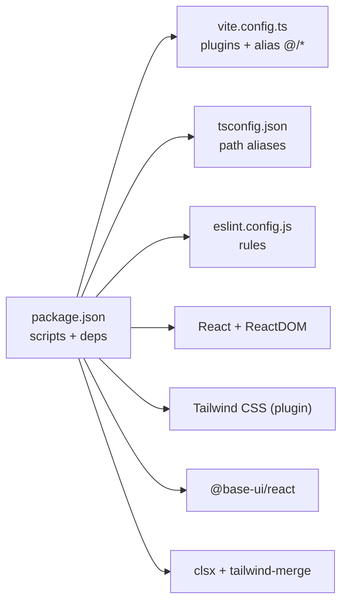

# Getting Started

<cite>
**Referenced Files in This Document**
- [package.json](file://package.json)
- [README.md](file://README.md)
- [vite.config.ts](file://vite.config.ts)
- [tsconfig.json](file://tsconfig.json)
- [eslint.config.js](file://eslint.config.js)
- [index.html](file://index.html)
- [src/index.css](file://src/index.css)
- [src/main.tsx](file://src/main.tsx)
- [src/App.tsx](file://src/App.tsx)
- [src/components/ui/table.tsx](file://src/components/ui/table.tsx)
- [src/lib/utils.ts](file://src/lib/utils.ts)
</cite>

## Table of Contents
1. [Introduction](#introduction)
2. [Project Structure](#project-structure)
3. [Core Components](#core-components)
4. [Architecture Overview](#architecture-overview)
5. [Detailed Component Analysis](#detailed-component-analysis)
6. [Dependency Analysis](#dependency-analysis)
7. [Performance Considerations](#performance-considerations)
8. [Troubleshooting Guide](#troubleshooting-guide)
9. [Conclusion](#conclusion)
10. [Appendices](#appendices)

## Introduction
This guide helps you quickly set up and run the Mulah project locally, explore the table component demonstrations, and understand how to modify and extend the UI components. The project is a React + TypeScript + Vite application with Tailwind CSS for styling and Base UI React for accessible primitives. You will learn how to install dependencies, start the development server, build for production, and customize the table components and styles.

## Project Structure
The project follows a straightforward React + Vite layout with TypeScript configuration and Tailwind CSS applied via the Vite plugin. Key areas:
- Application entry and rendering: [src/main.tsx](file://src/main.tsx)
- Root component and demos: [src/App.tsx](file://src/App.tsx)
- UI table components: [src/components/ui/table.tsx](file://src/components/ui/table.tsx)
- Utility class merging: [src/lib/utils.ts](file://src/lib/utils.ts)
- Styles and theme tokens: [src/index.css](file://src/index.css)
- Build and dev tooling: [vite.config.ts](file://vite.config.ts), [tsconfig.json](file://tsconfig.json), [eslint.config.js](file://eslint.config.js)
- Scripts and dependencies: [package.json](file://package.json)

**Diagram sources**
- [index.html](file://index.html)
- [src/main.tsx](file://src/main.tsx)
- [src/App.tsx](file://src/App.tsx)
- [src/components/ui/table.tsx](file://src/components/ui/table.tsx)
- [src/lib/utils.ts](file://src/lib/utils.ts)
- [src/index.css](file://src/index.css)
- [vite.config.ts](file://vite.config.ts)
- [tsconfig.json](file://tsconfig.json)
- [eslint.config.js](file://eslint.config.js)
- [package.json](file://package.json)

**Section sources**
- [index.html](file://index.html)
- [src/main.tsx](file://src/main.tsx)
- [src/App.tsx](file://src/App.tsx)
- [src/components/ui/table.tsx](file://src/components/ui/table.tsx)
- [src/lib/utils.ts](file://src/lib/utils.ts)
- [src/index.css](file://src/index.css)
- [vite.config.ts](file://vite.config.ts)
- [tsconfig.json](file://tsconfig.json)
- [eslint.config.js](file://eslint.config.js)
- [package.json](file://package.json)

## Core Components
- Table primitives: The table component library is composed of reusable parts for tables, headers, footers, rows, cells, captions, and a container wrapper. These components accept props and apply Tailwind-based styling via a shared utility.
- Demo pages: The root component renders two demonstration tables: one with raw data and another with calculated results derived from variables.
- Styling foundation: Tailwind is configured via the Vite plugin and a theme layer defines semantic color tokens and radii. The cn() utility merges and deduplicates Tailwind classes.

What you will build during this guide:
- Run the development server and view the demo tables
- Modify the demo data and calculations
- Customize table styles and add new calculations
- Build and preview the production bundle

**Section sources**
- [src/components/ui/table.tsx](file://src/components/ui/table.tsx)
- [src/App.tsx](file://src/App.tsx)
- [src/index.css](file://src/index.css)
- [src/lib/utils.ts](file://src/lib/utils.ts)

## Architecture Overview
High-level flow from browser to UI components:
- index.html mounts a script that loads the React app entry.
- main.tsx creates the root and renders App.
- App composes table components to render demo tables.
- Table components use cn() to merge Tailwind classes and data attributes for slot-based styling.
- Vite handles module resolution, React Fast Refresh, and CSS processing via Tailwind.

**Diagram sources**
- [index.html](file://index.html)
- [src/main.tsx](file://src/main.tsx)
- [src/App.tsx](file://src/App.tsx)
- [src/components/ui/table.tsx](file://src/components/ui/table.tsx)

## Detailed Component Analysis

### Table Component Library
The table library exposes a set of primitive components that wrap native HTML elements and apply consistent styling and accessibility attributes. Each component accepts className and forwards other props to the underlying element. Styling relies on Tailwind utilities and the cn() utility for safe merging.

How to customize:
- Extend className on any component to adjust spacing, colors, or shadows.
- Use data-slot attributes to scope styles when needed.
- Adjust theme tokens in the CSS layer to change base colors and radii.

**Diagram sources**
- [src/components/ui/table.tsx](file://src/components/ui/table.tsx)
- [src/lib/utils.ts](file://src/lib/utils.ts)

**Section sources**
- [src/components/ui/table.tsx](file://src/components/ui/table.tsx)
- [src/lib/utils.ts](file://src/lib/utils.ts)

### Demo Pages (App)
The root component demonstrates:
- Declaring variables and computing derived values
- Rendering a table of raw data
- Rendering a second table of calculated results

Key ideas:
- Data arrays are mapped to rows
- Calculations are performed in the component and rendered in cells
- Styling is applied via Tailwind classes on header and cell elements

Next steps:
- Edit the variable declarations to change computed values
- Add new rows or columns to the data arrays
- Introduce additional calculations and render them in a third table

**Section sources**
- [src/App.tsx](file://src/App.tsx)

### Styling and Theme Tokens
Tailwind is integrated via the Vite plugin and configured through a CSS layer that defines theme tokens for colors and radii. The cn() utility merges classes safely, preventing conflicts.

Practical tips:
- Use semantic color tokens to keep themes consistent
- Leverage data-slot attributes for targeted styling
- Keep className composition explicit for readability

**Section sources**
- [src/index.css](file://src/index.css)
- [src/lib/utils.ts](file://src/lib/utils.ts)

## Dependency Analysis
The project’s runtime and dev dependencies include React, React DOM, Tailwind CSS (via Vite plugin), Base UI React, and utility libraries for class merging. Scripts are provided for development, building, linting, and previewing.

**Diagram sources**
- [package.json](file://package.json)
- [vite.config.ts](file://vite.config.ts)
- [tsconfig.json](file://tsconfig.json)
- [eslint.config.js](file://eslint.config.js)

**Section sources**
- [package.json](file://package.json)
- [vite.config.ts](file://vite.config.ts)
- [tsconfig.json](file://tsconfig.json)
- [eslint.config.js](file://eslint.config.js)

## Performance Considerations
- Prefer lightweight components and avoid unnecessary re-renders by keeping data stable and using keys when mapping lists.
- Use Tailwind utilities sparingly to reduce CSS output.
- Keep calculations outside of render loops or memoize where appropriate.
- Use the preview script to test performance before shipping.

[No sources needed since this section provides general guidance]

## Troubleshooting Guide
Common beginner issues and resolutions:
- Node.js version mismatch
  - Symptom: Build errors or plugin failures
  - Action: Ensure your Node.js version satisfies the project’s requirements; consult the package manager logs for compatibility hints
- Missing dependencies after clone
  - Symptom: Import errors or “Cannot find module” messages
  - Action: Install dependencies using your preferred package manager; confirm lockfile presence
- Tailwind classes not applying
  - Symptom: Components render but styles are missing
  - Action: Verify Tailwind plugin is active in Vite config and that your CSS layer is imported; ensure PostCSS/Tailwind are installed per the plugin
- Path aliases not resolving
  - Symptom: Module not found errors for aliased imports
  - Action: Confirm tsconfig path aliases and Vite alias match; restart dev server after changes
- ESLint errors blocking development
  - Symptom: Lint warnings or errors during dev
  - Action: Fix reported issues or adjust rules in the ESLint config as needed
- Port already in use
  - Symptom: Dev server fails to start
  - Action: Change port in Vite config or kill the conflicting process

**Section sources**
- [package.json](file://package.json)
- [vite.config.ts](file://vite.config.ts)
- [tsconfig.json](file://tsconfig.json)
- [eslint.config.js](file://eslint.config.js)

## Conclusion
You now have the essentials to run the project, understand the table component library, and customize the demos. Continue by experimenting with data, calculations, and styling, then explore integrating these components into larger applications.

[No sources needed since this section summarizes without analyzing specific files]

## Appendices

### Quick Setup and First Run
- Prerequisites
  - Node.js compatible with the project’s dependencies
- Install dependencies
  - Use your package manager to install dependencies
- Start the development server
  - Run the dev script to launch the app with hot reload
- View the demos
  - Open the local URL shown by the dev server
- Build for production
  - Run the build script to compile TypeScript and assets
- Preview the production build
  - Run the preview script to serve the built assets locally

**Section sources**
- [package.json](file://package.json)
- [index.html](file://index.html)
- [src/main.tsx](file://src/main.tsx)
- [vite.config.ts](file://vite.config.ts)

### Understanding the Table Demonstrations
- Explore the demo tables
  - The root component renders two tables: one with raw data and another with calculated results
- Modify the data
  - Edit the data array used to render the first table
- Add new calculations
  - Define new variables and include them in the second table
- Customize styling
  - Adjust Tailwind classes on headers and cells
  - Tweak theme tokens in the CSS layer for consistent colors and radii

**Section sources**
- [src/App.tsx](file://src/App.tsx)
- [src/components/ui/table.tsx](file://src/components/ui/table.tsx)
- [src/index.css](file://src/index.css)

### Extending the Table Components
- Add new columns or rows
  - Extend the data structures and map them into the table
- Introduce new calculations
  - Compute values in the component and render them in a dedicated row
- Style improvements
  - Use the cn() utility and data-slot attributes to scope styles
  - Adjust theme tokens for consistent visuals

**Section sources**
- [src/App.tsx](file://src/App.tsx)
- [src/components/ui/table.tsx](file://src/components/ui/table.tsx)
- [src/lib/utils.ts](file://src/lib/utils.ts)
- [src/index.css](file://src/index.css)