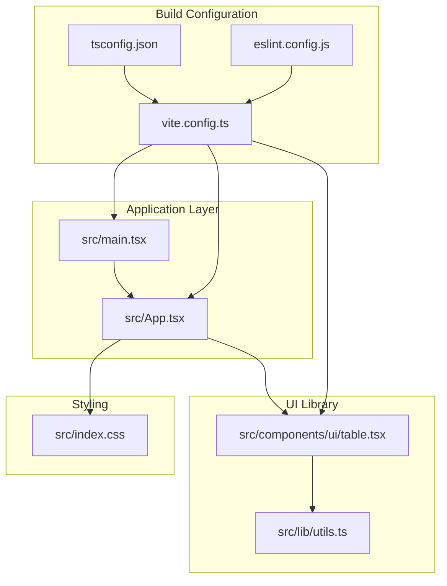
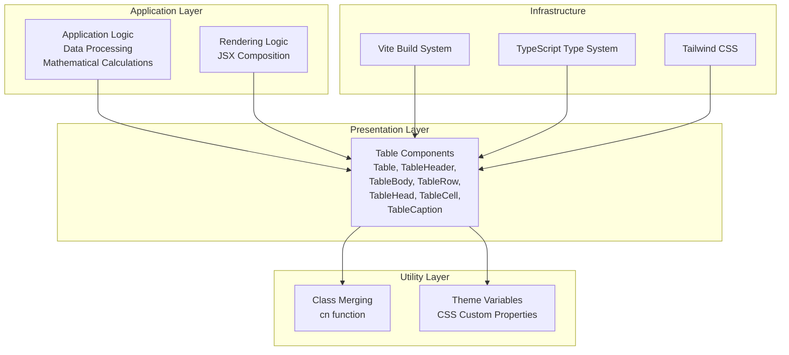
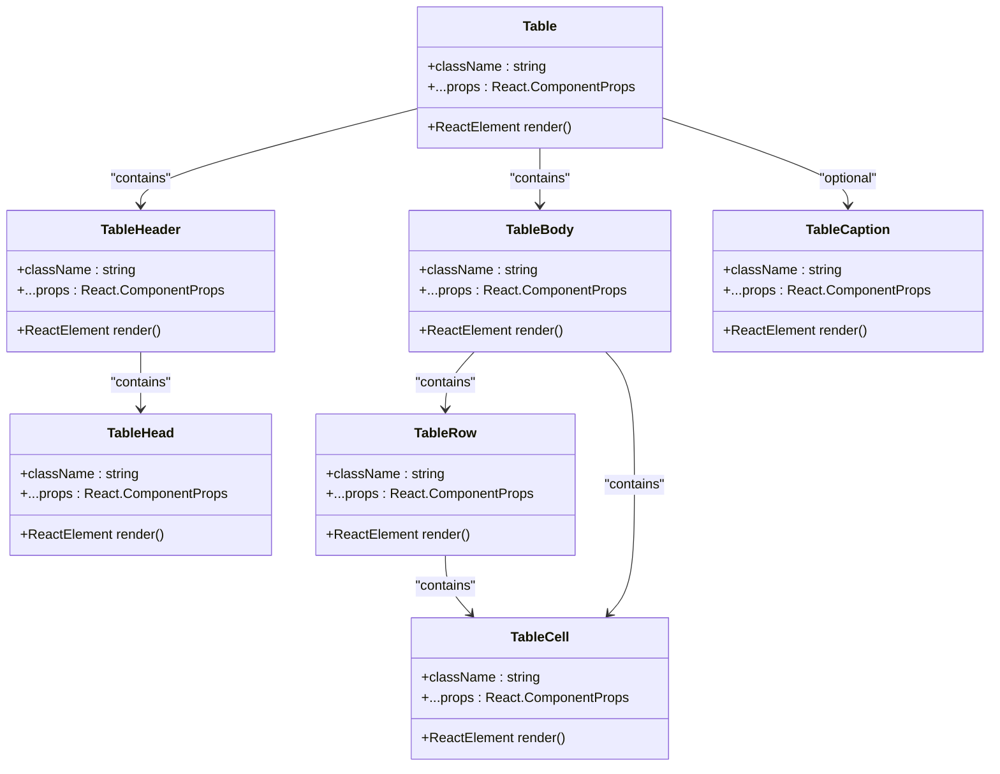
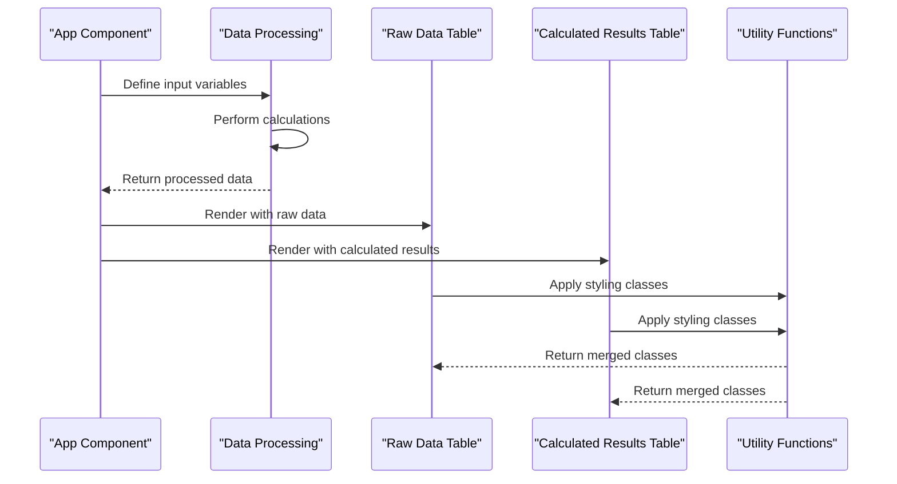
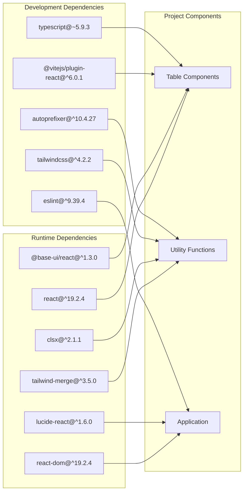

# Project Overview

<cite>
**Referenced Files in This Document**
- [README.md](file://README.md)
- [package.json](file://package.json)
- [vite.config.ts](file://vite.config.ts)
- [tsconfig.json](file://tsconfig.json)
- [tsconfig.app.json](file://tsconfig.app.json)
- [tsconfig.node.json](file://tsconfig.node.json)
- [eslint.config.js](file://eslint.config.js)
- [src/main.tsx](file://src/main.tsx)
- [src/App.tsx](file://src/App.tsx)
- [src/index.css](file://src/index.css)
- [src/lib/utils.ts](file://src/lib/utils.ts)
- [src/components/ui/table.tsx](file://src/components/ui/table.tsx)
</cite>

## Table of Contents
1. [Introduction](#introduction)
2. [Project Structure](#project-structure)
3. [Core Components](#core-components)
4. [Architecture Overview](#architecture-overview)
5. [Detailed Component Analysis](#detailed-component-analysis)
6. [Dependency Analysis](#dependency-analysis)
7. [Performance Considerations](#performance-considerations)
8. [Troubleshooting Guide](#troubleshooting-guide)
9. [Conclusion](#conclusion)

## Introduction
This project demonstrates a React-based component library showcase focused on a reusable table component system. It serves as an educational resource for React developers to understand modern component composition, TypeScript integration, and Tailwind CSS styling patterns. The implementation emphasizes clean separation of concerns, type-safe props, and utility-driven styling with a focus on accessibility and maintainability.

The project showcases two primary demonstrations:
- A raw data table displaying static values
- A calculated results table performing mathematical operations with dynamic values

This approach provides both conceptual learning for beginners and practical implementation details for experienced developers working with component libraries in React applications.

## Project Structure
The project follows a modular React application structure with a dedicated UI component library under the components directory. The architecture separates concerns between presentation components, utility functions, and application-level logic.

**Diagram sources**
- [src/main.tsx:1-11](file://src/main.tsx#L1-L11)
- [src/App.tsx:1-102](file://src/App.tsx#L1-L102)
- [src/components/ui/table.tsx:1-133](file://src/components/ui/table.tsx#L1-L133)
- [src/lib/utils.ts:1-7](file://src/lib/utils.ts#L1-L7)
- [vite.config.ts:1-15](file://vite.config.ts#L1-L15)
- [tsconfig.json:1-19](file://tsconfig.json#L1-L19)
- [eslint.config.js:1-24](file://eslint.config.js#L1-L24)

**Section sources**
- [src/main.tsx:1-11](file://src/main.tsx#L1-L11)
- [src/App.tsx:1-102](file://src/App.tsx#L1-L102)
- [vite.config.ts:1-15](file://vite.config.ts#L1-L15)
- [tsconfig.json:1-19](file://tsconfig.json#L1-L19)

## Core Components
The project centers around a cohesive table component system that demonstrates modern React patterns and component composition. The implementation showcases several key architectural decisions:

### Component Library Design
The table component system consists of seven distinct components that work together to form a complete table interface:
- Table: Container wrapper with responsive overflow handling
- TableHeader: Semantic header container
- TableBody: Data rendering container
- TableFooter: Optional footer container
- TableRow: Individual row with state management
- TableHead: Header cell with typography styling
- TableCell: Standard cell with padding and alignment
- TableCaption: Optional table caption element

### Utility Function Integration
The project utilizes a centralized utility function for class merging and styling consistency. The `cn` function combines Tailwind CSS classes while preventing conflicts through intelligent merging.

### Mathematical Calculation Demonstration
The application demonstrates practical data processing by performing calculations on input values and displaying results in a structured table format. This showcases how component libraries can handle dynamic data transformations while maintaining type safety.

**Section sources**
- [src/components/ui/table.tsx:1-133](file://src/components/ui/table.tsx#L1-L133)
- [src/lib/utils.ts:1-7](file://src/lib/utils.ts#L1-L7)
- [src/App.tsx:1-102](file://src/App.tsx#L1-L102)

## Architecture Overview
The project implements a layered architecture that separates concerns between component definition, styling, and application logic. This approach enables easy maintenance and extension of the component library.

**Diagram sources**
- [src/components/ui/table.tsx:1-133](file://src/components/ui/table.tsx#L1-L133)
- [src/lib/utils.ts:1-7](file://src/lib/utils.ts#L1-L7)
- [src/App.tsx:1-102](file://src/App.tsx#L1-L102)
- [src/index.css:1-40](file://src/index.css#L1-L40)
- [vite.config.ts:1-15](file://vite.config.ts#L1-L15)

The architecture emphasizes:
- **Separation of Concerns**: Each component has a single responsibility
- **Composition Over Inheritance**: Components are built by composing smaller elements
- **Type Safety**: Full TypeScript integration ensures compile-time safety
- **Styling Consistency**: Centralized utility functions prevent style conflicts
- **Accessibility**: Semantic HTML elements and proper ARIA attributes

## Detailed Component Analysis

### Table Component System
The table component system demonstrates advanced React patterns including component composition, prop forwarding, and context-free design.

**Diagram sources**
- [src/components/ui/table.tsx:4-133](file://src/components/ui/table.tsx#L4-L133)

#### Implementation Patterns
The components utilize several advanced React patterns:
- **Prop Forwarding**: All components forward unknown props to underlying DOM elements
- **TypeScript Integration**: Full type safety with React.ComponentProps
- **Utility Function Integration**: Consistent class merging through the cn function
- **Data Attributes**: Strategic use of data-slot attributes for styling hooks
- **Responsive Design**: Built-in overflow handling for mobile devices

#### Styling Architecture
Each component applies Tailwind CSS classes conditionally based on their role within the table hierarchy. The styling system uses:
- **CSS Custom Properties**: Theme variables for consistent color schemes
- **Utility-First Approach**: Atomic CSS classes for maintainability
- **Conditional Styling**: Dynamic class application based on component state
- **Responsive Breakpoints**: Mobile-first design with overflow handling

**Section sources**
- [src/components/ui/table.tsx:1-133](file://src/components/ui/table.tsx#L1-L133)
- [src/lib/utils.ts:1-7](file://src/lib/utils.ts#L1-L7)

### Application Logic and Data Flow
The application demonstrates practical data processing through mathematical calculations while showcasing component composition patterns.

**Diagram sources**
- [src/App.tsx:1-102](file://src/App.tsx#L1-L102)
- [src/lib/utils.ts:1-7](file://src/lib/utils.ts#L1-L7)

The data flow demonstrates:
- **Static Data Management**: Input variables defined at component level
- **Dynamic Calculations**: Mathematical operations performed during render
- **Component Composition**: Multiple table instances with different data sets
- **Styling Integration**: Utility functions applied consistently across components

**Section sources**
- [src/App.tsx:1-102](file://src/App.tsx#L1-L102)

### Educational Value and Real-World Applicability
The project provides significant educational value for React developers at different skill levels:

#### Beginner-Friendly Concepts
- **Component Composition**: Clear examples of building complex UIs from simple components
- **TypeScript Integration**: Practical usage of TypeScript with React components
- **Styling Patterns**: Demonstration of utility-first CSS approaches
- **Build System**: Modern development workflow with Vite and TypeScript

#### Advanced Implementation Details
- **Performance Optimization**: Efficient rendering patterns and prop forwarding
- **Accessibility**: Semantic HTML and proper ARIA attributes
- **Maintainability**: Clean separation of concerns and modular design
- **Extensibility**: Easy to extend components with additional features

**Section sources**
- [README.md:1-74](file://README.md#L1-L74)
- [package.json:1-40](file://package.json#L1-L40)

## Dependency Analysis
The project maintains a lean dependency graph focused on essential functionality for a React component library demonstration.

**Diagram sources**
- [package.json:12-38](file://package.json#L12-L38)

The dependency analysis reveals:
- **Minimal Runtime Dependencies**: Focus on essential libraries for React and styling
- **Modern Tooling**: Latest versions of React, TypeScript, and build tools
- **Styling Efficiency**: Single-purpose utility libraries for class merging
- **Development Experience**: Comprehensive tooling for modern development workflows

**Section sources**
- [package.json:1-40](file://package.json#L1-L40)

## Performance Considerations
The project implements several performance optimization strategies suitable for component library development:

### Rendering Optimizations
- **Component Composition**: Minimal re-rendering through proper component boundaries
- **Prop Forwarding**: Efficient prop passing without unnecessary wrappers
- **Conditional Styling**: Dynamic class application only when needed
- **Responsive Design**: Built-in overflow handling prevents layout thrashing

### Build-Time Optimizations
- **Tree Shaking**: Modular component structure enables dead code elimination
- **TypeScript Compilation**: Strict type checking catches performance issues early
- **Modern Build Tools**: Vite provides fast development builds and optimized production bundles

### Memory Management
- **Component Lifecycle**: Proper cleanup of event listeners and subscriptions
- **State Management**: Minimal internal state reduces memory footprint
- **Event Delegation**: Efficient event handling through React's synthetic events

## Troubleshooting Guide
Common issues and solutions for React component library development:

### Build Issues
- **TypeScript Errors**: Ensure proper type definitions and module resolution
- **Import Path Issues**: Verify path aliases in tsconfig.json match actual file structure
- **CSS Conflicts**: Check for conflicting Tailwind classes and utility function usage

### Runtime Issues
- **Component Prop Validation**: Use PropTypes or TypeScript interfaces for prop validation
- **Styling Conflicts**: Ensure utility function is applied consistently across components
- **Accessibility Issues**: Verify semantic HTML structure and ARIA attributes

### Development Workflow
- **Hot Reload Issues**: Check Vite configuration and plugin compatibility
- **Linting Errors**: Configure ESLint rules appropriately for component development
- **Performance Bottlenecks**: Profile rendering performance and optimize component boundaries

**Section sources**
- [tsconfig.json:1-19](file://tsconfig.json#L1-L19)
- [vite.config.ts:1-15](file://vite.config.ts#L1-L15)
- [eslint.config.js:1-24](file://eslint.config.js#L1-L24)

## Conclusion
The Mulah project successfully demonstrates a modern React component library approach focused on table components and mathematical calculations. The implementation showcases best practices in component composition, TypeScript integration, and Tailwind CSS styling while maintaining educational value for developers at all skill levels.

Key achievements include:
- **Clean Architecture**: Well-separated concerns with clear component boundaries
- **Type Safety**: Comprehensive TypeScript integration throughout the codebase
- **Styling Consistency**: Utility-first approach with intelligent class merging
- **Practical Examples**: Real-world demonstrations of data processing and display
- **Modern Tooling**: Up-to-date development stack with optimal developer experience

This project serves as an excellent foundation for developers looking to understand component library development patterns, offering both conceptual insights for beginners and implementation details for experienced React developers.