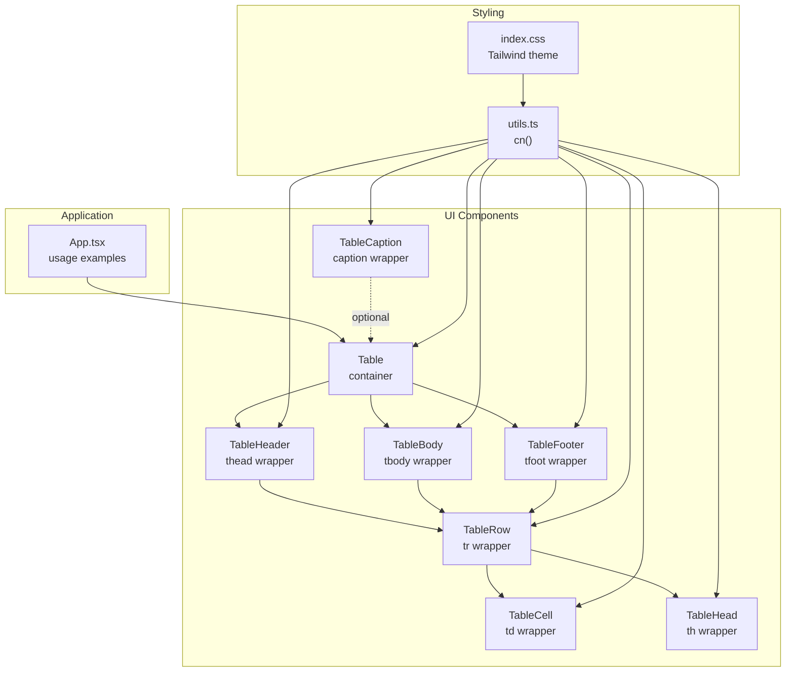
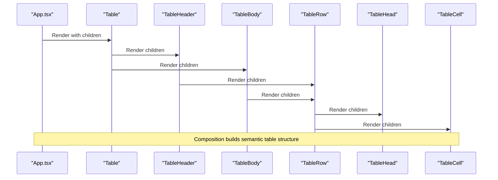
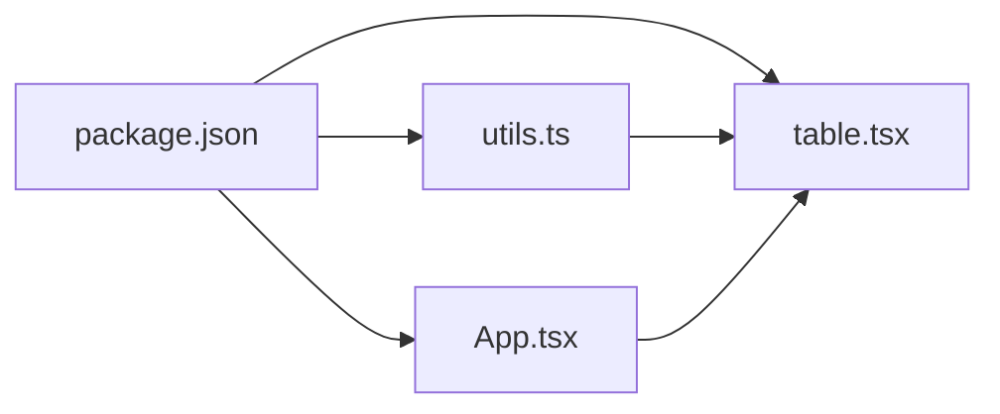

# Table Component System

<cite>
**Referenced Files in This Document**
- [table.tsx](file://src/components/ui/table.tsx)
- [utils.ts](file://src/lib/utils.ts)
- [App.tsx](file://src/App.tsx)
- [index.css](file://src/index.css)
- [package.json](file://package.json)
- [vite.config.ts](file://vite.config.ts)
- [tsconfig.json](file://tsconfig.json)
</cite>

## Table of Contents
1. [Introduction](#introduction)
2. [Project Structure](#project-structure)
3. [Core Components](#core-components)
4. [Architecture Overview](#architecture-overview)
5. [Detailed Component Analysis](#detailed-component-analysis)
6. [Dependency Analysis](#dependency-analysis)
7. [Performance Considerations](#performance-considerations)
8. [Troubleshooting Guide](#troubleshooting-guide)
9. [Conclusion](#conclusion)
10. [Appendices](#appendices)

## Introduction
This document describes the comprehensive table component system implemented in the project. It focuses on the complete table architecture and implementation, covering the component hierarchy (Table, TableHeader, TableBody, TableRow, TableCell, TableHead, TableCaption), composition patterns, prop interfaces, TypeScript type definitions, styling approach using Tailwind CSS classes, responsive design considerations, accessibility features, usage patterns for different scenarios, customization options, integration with external data sources, and performance best practices for large datasets.

## Project Structure
The table system is implemented as a set of composable React components located under the UI components directory. The styling relies on Tailwind CSS with a custom theme and a utility function for merging class names. The application demonstrates usage patterns with raw data and calculated results.

**Diagram sources**
- [table.tsx:1-133](file://src/components/ui/table.tsx#L1-L133)
- [utils.ts:1-7](file://src/lib/utils.ts#L1-L7)
- [index.css:1-40](file://src/index.css#L1-L40)
- [App.tsx:11-101](file://src/App.tsx#L11-L101)

**Section sources**
- [table.tsx:1-133](file://src/components/ui/table.tsx#L1-L133)
- [utils.ts:1-7](file://src/lib/utils.ts#L1-L7)
- [index.css:1-40](file://src/index.css#L1-L40)
- [App.tsx:11-101](file://src/App.tsx#L11-L101)

## Core Components
This section documents each component’s role, props interface, and styling approach.

- Table
  - Purpose: Wraps the native HTML table element inside a horizontally scrollable container for responsive behavior.
  - Props: Inherits all props from the native HTML table element plus an optional className.
  - Styling: Applies width, caption alignment, and slot attributes for downstream styling hooks.
  - Accessibility: Uses a native table structure suitable for assistive technologies.
  - Example usage: See [App.tsx:53-68](file://src/App.tsx#L53-L68).

- TableHeader
  - Purpose: Wraps thead and applies header-specific styles and responsive variants.
  - Props: Inherits all props from the native thead element plus an optional className.
  - Styling: Uses attribute selectors to adjust row and cell styles when placed inside a framed context.
  - Example usage: See [App.tsx:54-58](file://src/App.tsx#L54-L58).

- TableBody
  - Purpose: Wraps tbody and applies body-specific styles, including rounded corners and shadows when framed.
  - Props: Inherits all props from the native tbody element plus an optional className.
  - Styling: Provides hover and selection states, and adjusts padding and borders in framed contexts.
  - Example usage: See [App.tsx:60-66](file://src/App.tsx#L60-L66).

- TableFooter
  - Purpose: Wraps tfoot and applies footer-specific styles.
  - Props: Inherits all props from the native tfoot element plus an optional className.
  - Styling: Adds border and muted background, with special handling in framed contexts.
  - Example usage: See [App.tsx:76-96](file://src/App.tsx#L76-L96).

- TableRow
  - Purpose: Wraps tr and applies row-level styles including hover and selection states.
  - Props: Inherits all props from the native tr element plus an optional className.
  - Styling: Adds transitions, hover effects, and selection highlighting.
  - Example usage: See [App.tsx:61-66](file://src/App.tsx#L61-L66).

- TableHead
  - Purpose: Wraps th and applies header cell styles.
  - Props: Inherits all props from the native th element plus an optional className.
  - Styling: Controls height, padding, typography, and checkbox alignment adjustments.
  - Example usage: See [App.tsx:56-57](file://src/App.tsx#L56-L57).

- TableCell
  - Purpose: Wraps td and applies cell styles.
  - Props: Inherits all props from the native td element plus an optional className.
  - Styling: Controls padding, alignment, and checkbox spacing adjustments.
  - Example usage: See [App.tsx:63-64](file://src/App.tsx#L63-L64).

- TableCaption
  - Purpose: Wraps caption and applies caption-specific styles.
  - Props: Inherits all props from the native caption element plus an optional className.
  - Styling: Adjusts margins and typography in framed contexts.
  - Example usage: See [App.tsx:121-131](file://src/App.tsx#L121-L131).

**Section sources**
- [table.tsx:4-20](file://src/components/ui/table.tsx#L4-L20)
- [table.tsx:22-36](file://src/components/ui/table.tsx#L22-L36)
- [table.tsx:38-52](file://src/components/ui/table.tsx#L38-L52)
- [table.tsx:54-68](file://src/components/ui/table.tsx#L54-L68)
- [table.tsx:70-84](file://src/components/ui/table.tsx#L70-L84)
- [table.tsx:86-100](file://src/components/ui/table.tsx#L86-L100)
- [table.tsx:102-116](file://src/components/ui/table.tsx#L102-L116)
- [table.tsx:118-132](file://src/components/ui/table.tsx#L118-L132)

## Architecture Overview
The table system follows a composition-first approach. Each component wraps a native HTML element and augments it with Tailwind classes via a shared utility. The utility merges classes safely, preventing conflicts and ensuring predictable overrides. The application demonstrates two usage patterns: raw data display and calculated results display.

**Diagram sources**
- [App.tsx:53-68](file://src/App.tsx#L53-L68)
- [table.tsx:4-20](file://src/components/ui/table.tsx#L4-L20)
- [table.tsx:22-36](file://src/components/ui/table.tsx#L22-L36)
- [table.tsx:38-52](file://src/components/ui/table.tsx#L38-L52)
- [table.tsx:70-84](file://src/components/ui/table.tsx#L70-L84)
- [table.tsx:86-100](file://src/components/ui/table.tsx#L86-L100)
- [table.tsx:102-116](file://src/components/ui/table.tsx#L102-L116)

## Detailed Component Analysis

### Component Hierarchy and Composition Patterns
- Container and structural wrappers:
  - Table wraps the native table element and adds a horizontal scrolling container for responsiveness.
  - TableHeader, TableBody, TableFooter wrap the respective structural elements.
- Row and cell wrappers:
  - TableRow wraps tr and applies row-level states.
  - TableHead wraps th and applies header cell styles.
  - TableCell wraps td and applies cell styles.
- Caption support:
  - TableCaption wraps caption for optional table captions.

Composition patterns:
- Children-first rendering: Each wrapper forwards all props to its underlying element, enabling straightforward composition.
- Slot attributes: Each wrapper sets a data-slot attribute to facilitate downstream styling and potential framework integrations.
- Utility-driven styling: All components rely on a shared cn() utility to merge Tailwind classes safely.

**Section sources**
- [table.tsx:4-20](file://src/components/ui/table.tsx#L4-L20)
- [table.tsx:22-36](file://src/components/ui/table.tsx#L22-L36)
- [table.tsx:38-52](file://src/components/ui/table.tsx#L38-L52)
- [table.tsx:54-68](file://src/components/ui/table.tsx#L54-L68)
- [table.tsx:70-84](file://src/components/ui/table.tsx#L70-L84)
- [table.tsx:86-100](file://src/components/ui/table.tsx#L86-L100)
- [table.tsx:102-116](file://src/components/ui/table.tsx#L102-L116)
- [table.tsx:118-132](file://src/components/ui/table.tsx#L118-L132)

### Prop Interfaces and TypeScript Type Definitions
- All components accept the same pattern:
  - className?: string
  - ...props: React.ComponentProps<"native-element"> (e.g., "table", "thead", "tbody", "tr", "th", "td", "caption")
- This ensures:
  - Native HTML attributes remain available (e.g., role, aria-* attributes).
  - Additional props like onClick, data-* attributes, and event handlers are preserved.
- The components are typed to forward props to their underlying native elements, maintaining type safety.

Practical implications:
- You can pass aria-label, aria-describedby, role, and other accessibility-related attributes through props.
- Event handlers like onClick can be attached to rows or cells.

**Section sources**
- [table.tsx:4-20](file://src/components/ui/table.tsx#L4-L20)
- [table.tsx:22-36](file://src/components/ui/table.tsx#L22-L36)
- [table.tsx:38-52](file://src/components/ui/table.tsx#L38-L52)
- [table.tsx:54-68](file://src/components/ui/table.tsx#L54-L68)
- [table.tsx:70-84](file://src/components/ui/table.tsx#L70-L84)
- [table.tsx:86-100](file://src/components/ui/table.tsx#L86-L100)
- [table.tsx:102-116](file://src/components/ui/table.tsx#L102-L116)
- [table.tsx:118-132](file://src/components/ui/table.tsx#L118-L132)

### Styling Approach Using Tailwind CSS Classes
- Utility function:
  - cn() merges Tailwind classes using clsx and tailwind-merge to prevent conflicts and ensure predictable overrides.
- Component-level styles:
  - Each wrapper applies a baseline set of Tailwind classes tailored to its semantic role.
  - Attribute selectors (e.g., in-data-[slot=frame]:*) adapt styles for framed contexts.
- Theme integration:
  - index.css defines a custom Tailwind theme with color tokens and radius variables.
  - The table components leverage these tokens for consistent colors and spacing.

Responsive design considerations:
- Table is wrapped in a horizontally scrollable container to handle narrow screens.
- Cells and headers use whitespace and padding utilities to balance readability across widths.

Accessibility features:
- Semantic HTML structure (table, thead, tbody, tr, th, td) is preserved.
- Attribute selectors and slot attributes enable downstream enhancements for advanced interactions (e.g., selection, hover states).

**Section sources**
- [utils.ts:1-7](file://src/lib/utils.ts#L1-L7)
- [table.tsx:11-18](file://src/components/ui/table.tsx#L11-L18)
- [table.tsx:28-35](file://src/components/ui/table.tsx#L28-L35)
- [table.tsx:44-51](file://src/components/ui/table.tsx#L44-L51)
- [table.tsx:60-67](file://src/components/ui/table.tsx#L60-L67)
- [table.tsx:76-83](file://src/components/ui/table.tsx#L76-L83)
- [table.tsx:92-99](file://src/components/ui/table.tsx#L92-L99)
- [table.tsx:108-115](file://src/components/ui/table.tsx#L108-L115)
- [table.tsx:124-131](file://src/components/ui/table.tsx#L124-L131)
- [index.css:3-29](file://src/index.css#L3-L29)

### Practical Examples: Mathematical Calculations and Data Integration
The application demonstrates two primary usage patterns:
- Raw data table:
  - Data is prepared in App.tsx and mapped into TableHeader and TableBody with TableRow and TableCell.
  - Example: [App.tsx:25-46](file://src/App.tsx#L25-L46) and [App.tsx:60-66](file://src/App.tsx#L60-L66).
- Calculated results table:
  - Variables are computed (e.g., addition, division, multiplication) and rendered in TableBody.
  - Example: [App.tsx:13-22](file://src/App.tsx#L13-L22) and [App.tsx:82-94](file://src/App.tsx#L82-L94).

Integration with external data sources:
- The same composition pattern applies when data comes from APIs or stores.
- Replace the inline arrays with fetched data and render dynamically using the same wrappers.

**Section sources**
- [App.tsx:13-22](file://src/App.tsx#L13-L22)
- [App.tsx:25-46](file://src/App.tsx#L25-L46)
- [App.tsx:53-68](file://src/App.tsx#L53-L68)
- [App.tsx:75-96](file://src/App.tsx#L75-L96)

### Usage Patterns and Customization Options
Common usage patterns:
- Basic table: Use Table with TableHeader and TableBody, populate with TableRow and TableCell.
- With footer: Add TableFooter alongside TableHeader and TableBody.
- With caption: Add TableCaption as a child of Table.
- Custom widths: Pass className to TableHead to adjust column widths.
- Selection and hover: Rely on built-in data-state and hover classes; customize colors via theme tokens.

Customization options:
- Override styles: Pass className to any wrapper to extend or override defaults.
- Theme tokens: Adjust colors and radii in index.css to match brand guidelines.
- Framed vs unframed: Attribute selectors adapt styles depending on context; ensure wrappers are used consistently.

**Section sources**
- [App.tsx:53-68](file://src/App.tsx#L53-L68)
- [App.tsx:75-96](file://src/App.tsx#L75-L96)
- [table.tsx:28-35](file://src/components/ui/table.tsx#L28-L35)
- [table.tsx:44-51](file://src/components/ui/table.tsx#L44-L51)
- [table.tsx:60-67](file://src/components/ui/table.tsx#L60-L67)
- [table.tsx:76-83](file://src/components/ui/table.tsx#L76-L83)
- [table.tsx:92-99](file://src/components/ui/table.tsx#L92-L99)
- [table.tsx:108-115](file://src/components/ui/table.tsx#L108-L115)
- [table.tsx:124-131](file://src/components/ui/table.tsx#L124-L131)
- [index.css:3-29](file://src/index.css#L3-L29)

## Dependency Analysis
External dependencies and their roles:
- clsx and tailwind-merge: Used by cn() to merge classes safely.
- Tailwind CSS: Provides utility classes for styling.
- React: Components are React elements.
- Tailwind theme: Defined in index.css; consumed by components.

Internal dependencies:
- table.tsx depends on utils.ts for cn().
- App.tsx imports and composes table components.

**Diagram sources**
- [package.json:12-20](file://package.json#L12-L20)
- [utils.ts:1-7](file://src/lib/utils.ts#L1-L7)
- [table.tsx:1](file://src/components/ui/table.tsx#L1)
- [App.tsx:2-9](file://src/App.tsx#L2-L9)

**Section sources**
- [package.json:12-20](file://package.json#L12-L20)
- [utils.ts:1-7](file://src/lib/utils.ts#L1-L7)
- [table.tsx:1](file://src/components/ui/table.tsx#L1)
- [App.tsx:2-9](file://src/App.tsx#L2-L9)

## Performance Considerations
- Rendering large datasets:
  - Prefer virtualization libraries (e.g., react-window, react-virtual) for very large tables to limit DOM nodes.
  - Memoize expensive computations used in rendering (e.g., derived values) to avoid re-renders.
- Minimizing re-renders:
  - Use React.memo for row components when data is static or infrequently changing.
  - Split data into chunks and render only visible rows.
- Styling performance:
  - Keep className overrides minimal; prefer theme tokens over ad-hoc classes.
  - Avoid excessive nesting of attribute selectors in custom CSS.
- Accessibility and UX:
  - Ensure keyboard navigation and focus management for interactive tables.
  - Provide loading states and skeleton placeholders for async data.

[No sources needed since this section provides general guidance]

## Troubleshooting Guide
Common issues and resolutions:
- Incorrect column widths:
  - Verify that TableHead receives a className with width utilities.
  - Ensure no conflicting styles override desired widths.
- Hover and selection visuals:
  - Confirm that data-state and hover classes are present on TableRow.
  - Adjust theme tokens if colors appear incorrect.
- Responsive layout problems:
  - Ensure the Table wrapper remains a scrollable container.
  - Check that cell paddings and whitespace utilities are appropriate for small screens.
- Accessibility warnings:
  - Provide aria-label or aria-describedby on Table when needed.
  - Use role and aria-* attributes on interactive elements within cells or rows.

**Section sources**
- [table.tsx:11-18](file://src/components/ui/table.tsx#L11-L18)
- [table.tsx:76-83](file://src/components/ui/table.tsx#L76-L83)
- [index.css:3-29](file://src/index.css#L3-L29)

## Conclusion
The table component system provides a robust, composable foundation for building accessible, responsive tables with Tailwind CSS. By leveraging wrappers around native HTML elements, a centralized utility for safe class merging, and a configurable theme, developers can quickly assemble tables for diverse use cases—from raw data displays to calculated results—while maintaining performance and accessibility best practices.

[No sources needed since this section summarizes without analyzing specific files]

## Appendices

### Appendix A: Build and Tooling Configuration
- Vite configuration enables React and Tailwind CSS plugins and resolves aliases.
- TypeScript configuration sets up path aliases for @/*.

**Section sources**
- [vite.config.ts:1-15](file://vite.config.ts#L1-L15)
- [tsconfig.json:1-19](file://tsconfig.json#L1-L19)