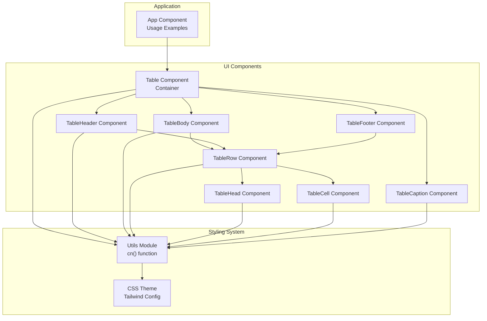
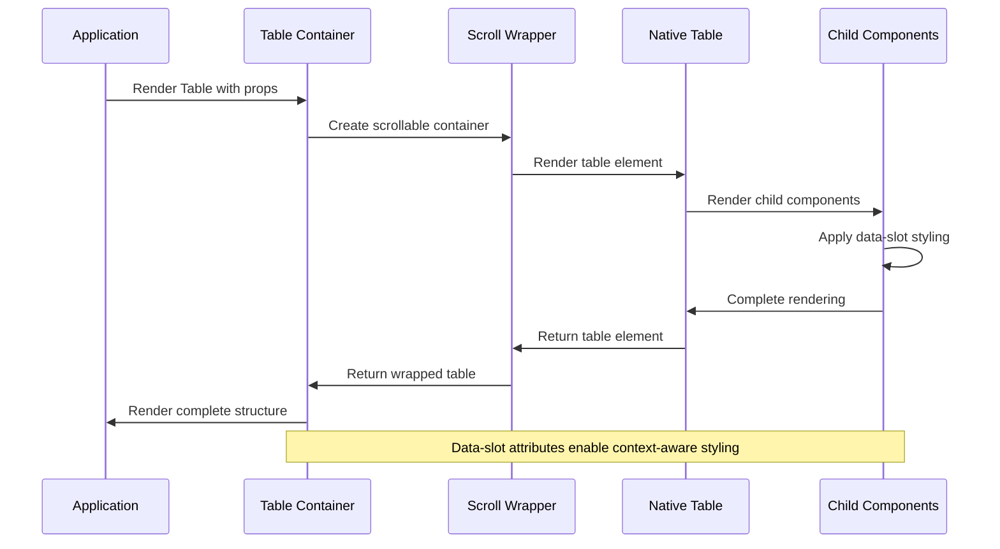
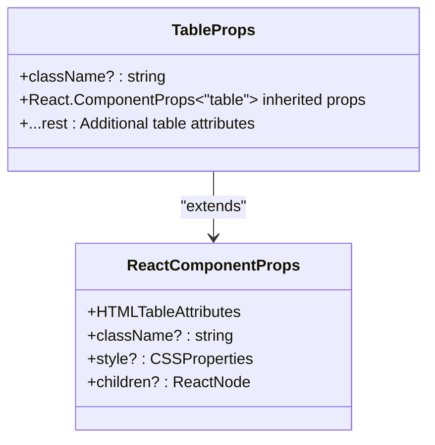
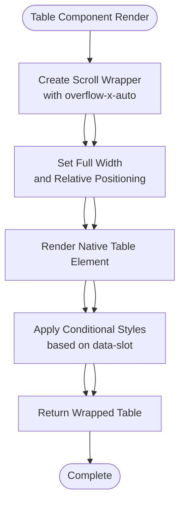
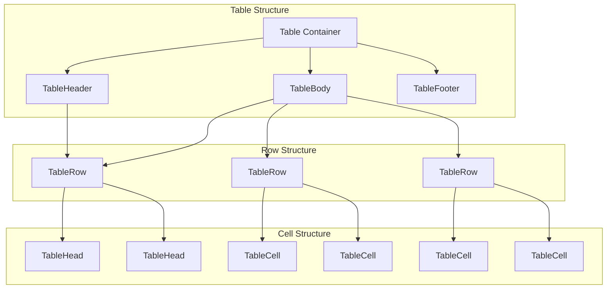
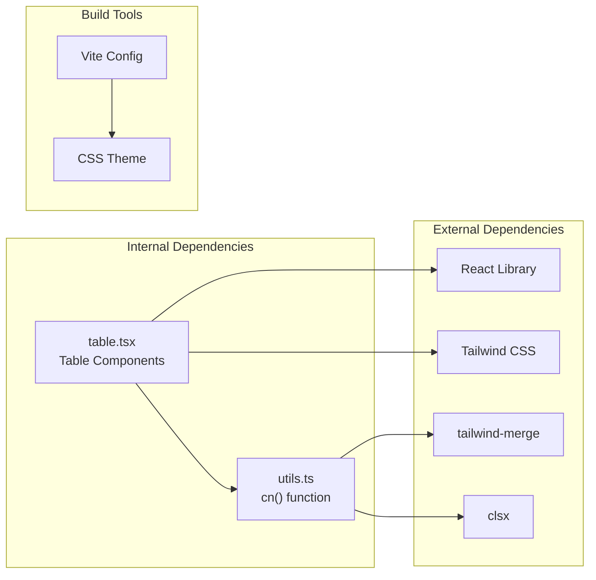

# Table Container Component

<cite>
**Referenced Files in This Document**
- [table.tsx](file://src/components/ui/table.tsx)
- [utils.ts](file://src/lib/utils.ts)
- [App.tsx](file://src/App.tsx)
- [index.css](file://src/index.css)
- [vite.config.ts](file://vite.config.ts)
- [package.json](file://package.json)
</cite>

## Table of Contents
1. [Introduction](#introduction)
2. [Project Structure](#project-structure)
3. [Core Components](#core-components)
4. [Architecture Overview](#architecture-overview)
5. [Detailed Component Analysis](#detailed-component-analysis)
6. [Dependency Analysis](#dependency-analysis)
7. [Performance Considerations](#performance-considerations)
8. [Troubleshooting Guide](#troubleshooting-guide)
9. [Conclusion](#conclusion)

## Introduction
This document provides comprehensive documentation for the Table container component ecosystem, focusing on the main Table component that serves as the primary container for complete table structures. The Table component wraps native HTML table elements with enhanced accessibility, styling hooks, and responsive scroll behavior. It implements a cohesive design system using data-slot attributes for accessibility and styling hooks, enabling consistent styling across different contexts while maintaining semantic HTML structure.

## Project Structure
The Table component system follows a modular architecture with the main Table component as the container and specialized child components for table structure elements. The implementation leverages Tailwind CSS utilities and a custom `cn` utility function for class composition.



**Diagram sources**
- [table.tsx:1-133](file://src/components/ui/table.tsx#L1-L133)
- [utils.ts:1-7](file://src/lib/utils.ts#L1-L7)
- [App.tsx:1-102](file://src/App.tsx#L1-L102)

**Section sources**
- [table.tsx:1-133](file://src/components/ui/table.tsx#L1-L133)
- [utils.ts:1-7](file://src/lib/utils.ts#L1-L7)
- [App.tsx:1-102](file://src/App.tsx#L1-L102)

## Core Components
The Table component system consists of seven primary components that work together to create accessible, responsive table structures:

### Table Container Component
The main Table component serves as the primary container with built-in scrollable functionality. It wraps native HTML table elements and provides essential styling hooks through data-slot attributes.

### Child Component Hierarchy
- **TableHeader**: Contains table header structure with specialized styling for frame contexts
- **TableBody**: Manages table body content with advanced hover and selection states
- **TableFooter**: Handles footer content with frame-aware styling
- **TableRow**: Individual table rows with interactive states
- **TableHead**: Header cells with responsive width handling
- **TableCell**: Data cells with padding and alignment controls
- **TableCaption**: Table captions with context-aware positioning

**Section sources**
- [table.tsx:4-20](file://src/components/ui/table.tsx#L4-L20)
- [table.tsx:22-132](file://src/components/ui/table.tsx#L22-L132)

## Architecture Overview
The Table component system implements a sophisticated data-slot architecture that enables conditional styling based on context. The main Table component creates a scrollable container while individual child components use data-slot attributes for targeted styling hooks.



**Diagram sources**
- [table.tsx:8-19](file://src/components/ui/table.tsx#L8-L19)
- [table.tsx:14-17](file://src/components/ui/table.tsx#L14-L17)

The architecture ensures that:
- The Table component maintains native table semantics
- Scroll functionality is isolated to the container level
- Child components receive appropriate styling hooks
- Responsive behavior adapts to different screen sizes

**Section sources**
- [table.tsx:8-19](file://src/components/ui/table.tsx#L8-L19)
- [table.tsx:14-17](file://src/components/ui/table.tsx#L14-L17)

## Detailed Component Analysis

### Table Component Implementation
The Table component serves as the primary container with specialized props interface and scrollable functionality.

#### Props Interface Analysis
The Table component accepts a props interface that inherits from React's native table element props:



**Diagram sources**
- [table.tsx:4-7](file://src/components/ui/table.tsx#L4-L7)

#### Scrollable Container Implementation
The Table component creates a scrollable container using `overflow-x-auto` to handle responsive table layouts:



**Diagram sources**
- [table.tsx:8-19](file://src/components/ui/table.tsx#L8-L19)

#### Data-Slot Attribute System
Each component in the Table ecosystem uses data-slot attributes for accessibility and styling hooks:

| Component | Data-Slot Value | Purpose |
|-----------|----------------|---------|
| Table Container | `table-container` | Identifies the scrollable wrapper |
| Table Element | `table` | Targets the native table element |
| Table Header | `table-header` | Styles header section |
| Table Body | `table-body` | Styles body content |
| Table Footer | `table-footer` | Styles footer section |
| Table Row | `table-row` | Styles individual rows |
| Table Head | `table-head` | Styles header cells |
| Table Cell | `table-cell` | Styles data cells |
| Table Caption | `table-caption` | Styles table captions |

**Section sources**
- [table.tsx:8-19](file://src/components/ui/table.tsx#L8-L19)
- [table.tsx:14-17](file://src/components/ui/table.tsx#L14-L17)

### Child Component Relationships
The child components form a hierarchical structure that mirrors HTML table semantics while adding enhanced styling capabilities:



**Diagram sources**
- [table.tsx:22-132](file://src/components/ui/table.tsx#L22-L132)

**Section sources**
- [table.tsx:22-132](file://src/components/ui/table.tsx#L22-L132)

### Practical Usage Examples
The Table component is designed for flexible usage in various scenarios:

#### Basic Table Structure
```typescript
// Example structure from the application
<Table>
    <TableHeader>
        <TableRow>
            <TableHead>Column 1</TableHead>
            <TableHead>Column 2</TableHead>
        </TableRow>
    </TableHeader>
    <TableBody>
        <TableRow>
            <TableCell>Data 1</TableCell>
            <TableCell>Data 2</TableCell>
        </TableRow>
    </TableBody>
</Table>
```

#### Responsive Design Implementation
The Table component automatically handles responsive behavior through its scrollable container, ensuring tables remain usable on small screens without manual intervention.

**Section sources**
- [App.tsx:53-68](file://src/App.tsx#L53-L68)
- [App.tsx:75-96](file://src/App.tsx#L75-L96)

## Dependency Analysis
The Table component system has minimal external dependencies and follows a clean architecture pattern:



**Diagram sources**
- [table.tsx:1](file://src/components/ui/table.tsx#L1)
- [utils.ts:1](file://src/lib/utils.ts#L1)
- [vite.config.ts:1](file://vite.config.ts#L1)

### Component Coupling Analysis
The Table components demonstrate low coupling through:
- Shared props interface inheritance from React native elements
- Centralized styling through the `cn` utility function
- Consistent data-slot attribute system for styling hooks
- Modular component structure allowing independent usage

**Section sources**
- [table.tsx:1-7](file://src/components/ui/table.tsx#L1-L7)
- [utils.ts:4-6](file://src/lib/utils.ts#L4-L6)

## Performance Considerations
The Table component system is optimized for performance through several design decisions:

### Efficient Rendering
- Minimal DOM nodes created through component composition
- Native HTML table elements preserve browser optimization
- Conditional styling applied only when data-slot attributes match

### Memory Management
- Lightweight component structure reduces memory overhead
- No internal state management for basic table presentation
- Efficient class merging prevents unnecessary DOM updates

### Responsive Performance
- CSS-based scrolling avoids JavaScript event handlers
- Tailwind utilities compiled at build time
- Minimal runtime calculations for styling decisions

## Troubleshooting Guide

### Common Issues and Solutions

#### Scroll Behavior Problems
**Issue**: Tables not scrolling horizontally on small screens
**Solution**: Ensure the Table component is used as a wrapper around complete table structures, not individual elements

#### Styling Conflicts
**Issue**: Custom styles overriding Table component styles
**Solution**: Use the `className` prop to extend existing styles rather than replacing them entirely

#### Accessibility Concerns
**Issue**: Screen readers not announcing table structure correctly
**Solution**: Verify that all child components maintain their semantic HTML structure and data-slot attributes

#### Responsive Design Issues
**Issue**: Content overlapping on mobile devices
**Solution**: The Table component's scrollable container handles this automatically, but ensure parent containers don't restrict width

**Section sources**
- [table.tsx:8-19](file://src/components/ui/table.tsx#L8-L19)
- [table.tsx:14-17](file://src/components/ui/table.tsx#L14-L17)

## Conclusion
The Table container component system provides a robust, accessible, and responsive solution for building complex table interfaces. Through its innovative data-slot attribute system, the components maintain semantic HTML structure while enabling sophisticated styling hooks. The scrollable container functionality ensures excellent mobile responsiveness without sacrificing desktop usability. The modular architecture allows for flexible usage patterns while maintaining consistency across different contexts.

The implementation demonstrates best practices in React component design, including proper prop interface inheritance, efficient styling composition, and thoughtful accessibility considerations. The system is well-suited for production applications requiring complex data presentation with excellent user experience across all device sizes.