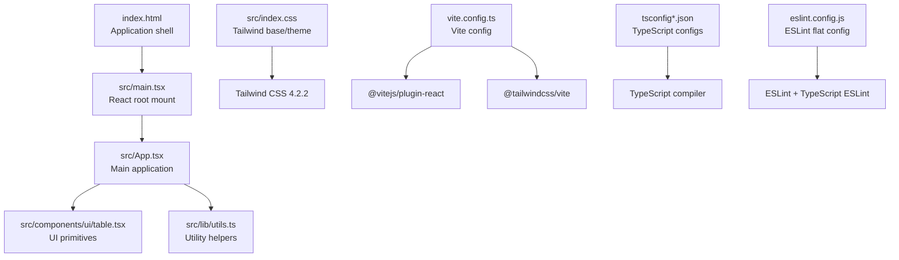
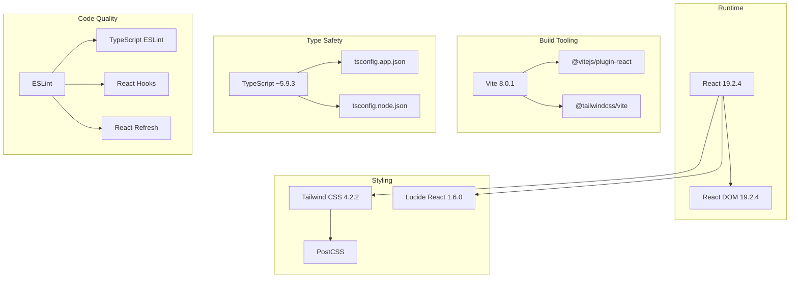
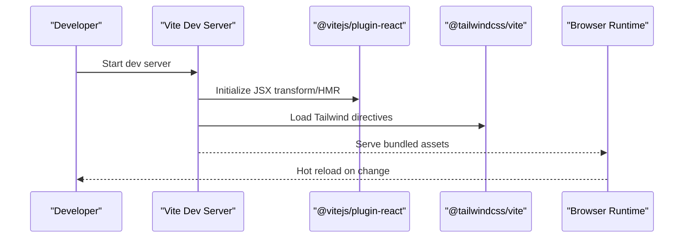
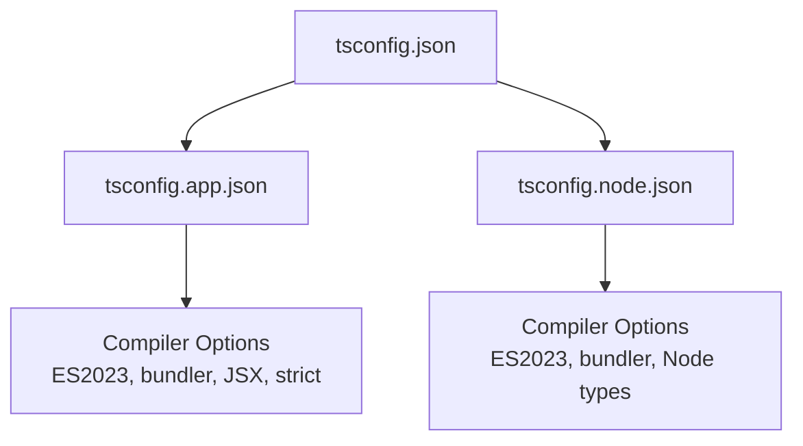
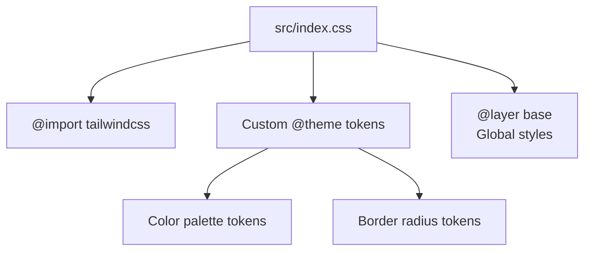
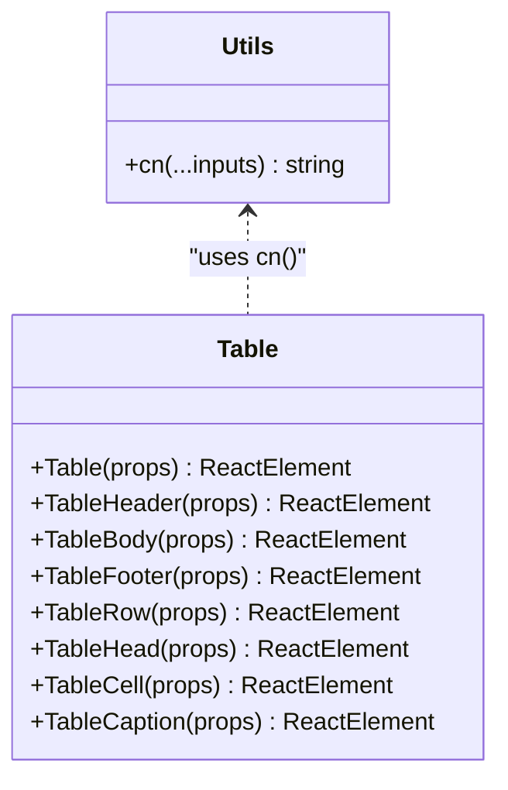
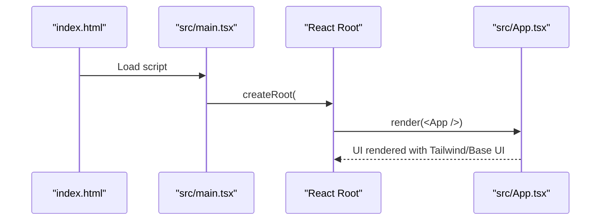
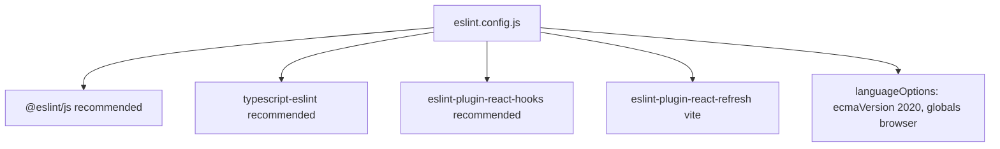
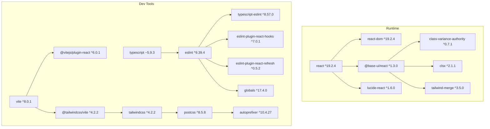

# Technology Stack & Dependencies

<cite>
**Referenced Files in This Document**
- [package.json](file://package.json)
- [vite.config.ts](file://vite.config.ts)
- [eslint.config.js](file://eslint.config.js)
- [tsconfig.json](file://tsconfig.json)
- [tsconfig.app.json](file://tsconfig.app.json)
- [tsconfig.node.json](file://tsconfig.node.json)
- [src/main.tsx](file://src/main.tsx)
- [src/App.tsx](file://src/App.tsx)
- [src/index.css](file://src/index.css)
- [src/lib/utils.ts](file://src/lib/utils.ts)
- [src/components/ui/table.tsx](file://src/components/ui/table.tsx)
- [index.html](file://index.html)
- [README.md](file://README.md)
</cite>

## Table of Contents
1. [Introduction](#introduction)
2. [Project Structure](#project-structure)
3. [Core Components](#core-components)
4. [Architecture Overview](#architecture-overview)
5. [Detailed Component Analysis](#detailed-component-analysis)
6. [Dependency Analysis](#dependency-analysis)
7. [Performance Considerations](#performance-considerations)
8. [Troubleshooting Guide](#troubleshooting-guide)
9. [Conclusion](#conclusion)
10. [Appendices](#appendices)

## Introduction
This document provides a comprehensive overview of the Mulah project’s technology stack and development toolchain. It focuses on how React 19.2.4, TypeScript, and Vite 8.0.1 form the core framework, how Tailwind CSS 4.2.2, Base UI 1.3.0, and Lucide React 1.6.0 deliver a modern, accessible, and utility-first UI experience, and how ESLint, PostCSS, and related tooling ensure code quality and developer productivity. The guide also covers dependency management, version compatibility, upgrade considerations, and practical insights into why these technologies were chosen to optimize the development experience for building component libraries.

## Project Structure
The project follows a conventional React + TypeScript + Vite setup with a clear separation of concerns:
- Application entry and rendering live under src with a root component mounting into index.html.
- UI primitives and shared utilities reside under src/components/ui and src/lib respectively.
- Styling is configured via Tailwind CSS with a custom theme and layered base styles.
- Build tooling is powered by Vite with React plugin and Tailwind integration.
- Type checking and linting are configured via TypeScript and ESLint flat config.

**Diagram sources**
- [index.html:1-14](file://index.html#L1-L14)
- [src/main.tsx:1-11](file://src/main.tsx#L1-L11)
- [src/App.tsx:1-102](file://src/App.tsx#L1-L102)
- [src/components/ui/table.tsx:1-133](file://src/components/ui/table.tsx#L1-L133)
- [src/lib/utils.ts:1-7](file://src/lib/utils.ts#L1-L7)
- [src/index.css:1-40](file://src/index.css#L1-L40)
- [vite.config.ts:1-15](file://vite.config.ts#L1-L15)
- [tsconfig.json:1-19](file://tsconfig.json#L1-L19)
- [tsconfig.app.json:1-40](file://tsconfig.app.json#L1-L40)
- [tsconfig.node.json:1-27](file://tsconfig.node.json#L1-L27)
- [eslint.config.js:1-24](file://eslint.config.js#L1-L24)

**Section sources**
- [index.html:1-14](file://index.html#L1-L14)
- [src/main.tsx:1-11](file://src/main.tsx#L1-L11)
- [src/App.tsx:1-102](file://src/App.tsx#L1-L102)
- [src/index.css:1-40](file://src/index.css#L1-L40)
- [vite.config.ts:1-15](file://vite.config.ts#L1-L15)
- [tsconfig.json:1-19](file://tsconfig.json#L1-L19)
- [tsconfig.app.json:1-40](file://tsconfig.app.json#L1-L40)
- [tsconfig.node.json:1-27](file://tsconfig.node.json#L1-L27)
- [eslint.config.js:1-24](file://eslint.config.js#L1-L24)

## Core Components
This section outlines the primary technologies and their roles in the stack.

- React 19.2.4 and React DOM 19.2.4
  - Core framework for building user interfaces with concurrent features and improved developer ergonomics.
  - Integrated via @vitejs/plugin-react in Vite for fast HMR and JSX transformations.

- TypeScript ~5.9.3
  - Provides strong typing across the codebase with strict compiler options and bundler-mode resolution.
  - Separate configs for app and node environments to ensure accurate type-checking and module resolution.

- Vite 8.0.1
  - Lightning-fast dev server and build tool with native ES modules support and optimized plugin ecosystem.
  - Configured with React and Tailwind CSS plugins and a path alias for clean imports.

- Tailwind CSS 4.2.2 and PostCSS
  - Utility-first CSS framework with a custom theme and layered base styles.
  - Enhanced by @tailwindcss/vite for seamless integration and automatic purging.

- Base UI 1.3.0
  - Accessible, unstyled primitives for building high-quality UI components.
  - Used here through the Table primitive family to construct tables with semantic markup and consistent styling.

- Lucide React 1.6.0
  - SVG icon library integrated directly into components for consistent iconography.

- ESLint with TypeScript ESLint and React-specific plugins
  - Enforces code quality and React best practices with flat config and recommended presets.
  - Supports type-aware linting when configured with project references.

- Utility helpers
  - cn function combining clsx and tailwind-merge for robust conditional class merging and conflict resolution.

**Section sources**
- [package.json:12-38](file://package.json#L12-L38)
- [vite.config.ts:1-15](file://vite.config.ts#L1-L15)
- [tsconfig.app.json:1-40](file://tsconfig.app.json#L1-L40)
- [tsconfig.node.json:1-27](file://tsconfig.node.json#L1-L27)
- [eslint.config.js:1-24](file://eslint.config.js#L1-L24)
- [src/index.css:1-40](file://src/index.css#L1-L40)
- [src/lib/utils.ts:1-7](file://src/lib/utils.ts#L1-L7)
- [src/components/ui/table.tsx:1-133](file://src/components/ui/table.tsx#L1-L133)

## Architecture Overview
The application architecture centers around a modular React component tree, with Tailwind CSS providing low-level styling utilities and Base UI offering accessible primitives. Vite orchestrates the build pipeline, while TypeScript and ESLint enforce type safety and code quality.

**Diagram sources**
- [package.json:12-38](file://package.json#L12-L38)
- [vite.config.ts:1-15](file://vite.config.ts#L1-L15)
- [tsconfig.app.json:1-40](file://tsconfig.app.json#L1-L40)
- [tsconfig.node.json:1-27](file://tsconfig.node.json#L1-L27)
- [eslint.config.js:1-24](file://eslint.config.js#L1-L24)

## Detailed Component Analysis

### React and Vite Integration
- Vite configuration enables the React plugin and Tailwind integration, along with a path alias for @ pointing to src.
- The React plugin ensures fast JSX transforms and HMR during development.
- The Tailwind plugin integrates Tailwind directives and utilities into the build pipeline.

**Diagram sources**
- [vite.config.ts:1-15](file://vite.config.ts#L1-L15)

**Section sources**
- [vite.config.ts:1-15](file://vite.config.ts#L1-L15)
- [package.json:7-11](file://package.json#L7-L11)

### TypeScript Configuration
- The root tsconfig.json references app and node configurations for a dual-project setup.
- tsconfig.app.json targets ES2023, uses bundler module resolution, and enforces strictness for local development.
- tsconfig.node.json targets ES2023 for Vite config and other Node-side scripts.

**Diagram sources**
- [tsconfig.json:1-19](file://tsconfig.json#L1-L19)
- [tsconfig.app.json:1-40](file://tsconfig.app.json#L1-L40)
- [tsconfig.node.json:1-27](file://tsconfig.node.json#L1-L27)

**Section sources**
- [tsconfig.json:1-19](file://tsconfig.json#L1-L19)
- [tsconfig.app.json:1-40](file://tsconfig.app.json#L1-L40)
- [tsconfig.node.json:1-27](file://tsconfig.node.json#L1-L27)

### Tailwind CSS and Theme
- Tailwind CSS 4.2.2 is imported and configured with a custom theme using CSS variables for colors and radii.
- The base layer applies global styles and ensures consistent border/background/foreground semantics.

**Diagram sources**
- [src/index.css:1-40](file://src/index.css#L1-L40)

**Section sources**
- [src/index.css:1-40](file://src/index.css#L1-L40)
- [package.json:34](file://package.json#L34)

### Base UI Primitives and Table Component
- The Table primitive family demonstrates Base UI’s accessible, unstyled primitives.
- The cn utility merges classes safely, leveraging clsx and tailwind-merge to prevent conflicts.

**Diagram sources**
- [src/lib/utils.ts:1-7](file://src/lib/utils.ts#L1-L7)
- [src/components/ui/table.tsx:1-133](file://src/components/ui/table.tsx#L1-L133)

**Section sources**
- [src/lib/utils.ts:1-7](file://src/lib/utils.ts#L1-L7)
- [src/components/ui/table.tsx:1-133](file://src/components/ui/table.tsx#L1-L133)

### Application Entry and Rendering
- The application mounts into index.html via src/main.tsx, rendering the root App component.
- App composes Base UI Table primitives and Tailwind utility classes to render structured data.

**Diagram sources**
- [index.html:1-14](file://index.html#L1-L14)
- [src/main.tsx:1-11](file://src/main.tsx#L1-L11)
- [src/App.tsx:1-102](file://src/App.tsx#L1-L102)

**Section sources**
- [index.html:1-14](file://index.html#L1-L14)
- [src/main.tsx:1-11](file://src/main.tsx#L1-L11)
- [src/App.tsx:1-102](file://src/App.tsx#L1-L102)

### ESLint Configuration and Modern JavaScript Features
- ESLint flat config extends recommended sets for JS, TypeScript, React hooks, and React refresh.
- Language options target ECMAScript 2020 with browser globals for client-side development.

**Diagram sources**
- [eslint.config.js:1-24](file://eslint.config.js#L1-L24)

**Section sources**
- [eslint.config.js:1-24](file://eslint.config.js#L1-L24)
- [package.json:21-37](file://package.json#L21-L37)

## Dependency Analysis
The project’s dependencies are carefully selected to balance developer experience, performance, and maintainability. The following diagram shows key runtime and dev-time dependencies and their relationships.

**Diagram sources**
- [package.json:12-38](file://package.json#L12-L38)

**Section sources**
- [package.json:12-38](file://package.json#L12-L38)

## Performance Considerations
- Vite 8.0.1 offers native ES modules and optimized plugin pipeline for rapid development and builds.
- React plugin with Oxc is used for fast JSX transforms and HMR.
- Tailwind integration via @tailwindcss/vite streamlines CSS processing and purging.
- TypeScript bundler mode and strict checks improve reliability without sacrificing speed.
- ESLint flat config reduces overhead and improves DX with recommended presets.

[No sources needed since this section provides general guidance]

## Troubleshooting Guide
- Build fails due to missing project references in ESLint
  - Ensure TypeScript project references are included in ESLint parser options when enabling type-aware rules.
  - Reference: [README.md:35-43](file://README.md#L35-L43)

- Tailwind utilities not applying
  - Verify Tailwind is imported and configured in src/index.css and that @tailwindcss/vite is present in Vite plugins.
  - Reference: [src/index.css:1](file://src/index.css#L1), [vite.config.ts:3](file://vite.config.ts#L3)

- Path aliases not resolving
  - Confirm baseUrl and paths are set in tsconfig.json and vite.config.ts.
  - References: [tsconfig.json:4-9](file://tsconfig.json#L4-L9), [vite.config.ts:9-13](file://vite.config.ts#L9-L13)

- React Compiler performance impact
  - The template intentionally avoids React Compiler to preserve dev/build performance.
  - Reference: [README.md:10-12](file://README.md#L10-L12)

**Section sources**
- [README.md:10-12](file://README.md#L10-L12)
- [README.md:35-43](file://README.md#L35-L43)
- [src/index.css:1](file://src/index.css#L1)
- [vite.config.ts:3](file://vite.config.ts#L3)
- [tsconfig.json:4-9](file://tsconfig.json#L4-L9)
- [vite.config.ts:9-13](file://vite.config.ts#L9-L13)

## Conclusion
The Mulah project’s technology stack combines React 19.2.4, TypeScript, and Vite 8.0.1 to deliver a modern, type-safe, and highly productive development environment. Tailwind CSS 4.2.2, Base UI 1.3.0, and Lucide React 1.6.0 provide a cohesive, accessible, and utility-first UI foundation. ESLint, PostCSS, and related tooling ensure consistent code quality and maintainability. Together, these technologies enable efficient component library development with strong performance and developer ergonomics.

[No sources needed since this section summarizes without analyzing specific files]

## Appendices

### Why These Technologies Were Chosen
- React 19.2.4: Latest concurrent features and improved developer experience.
- TypeScript: Predictable code quality and refactoring safety.
- Vite 8.0.1: Fast dev server and optimized build pipeline.
- Tailwind CSS 4.2.2: Utility-first styling with custom themes and layering.
- Base UI 1.3.0: Accessible, unstyled primitives for robust components.
- Lucide React 1.6.0: Consistent, scalable iconography.
- ESLint + TypeScript ESLint: Strong static analysis and React best practices.

[No sources needed since this section provides general guidance]

### Upgrade Considerations
- React and React DOM: Align versions to avoid mismatched reconciler behavior.
- Vite: Review plugin compatibility and migration guides for major updates.
- Tailwind CSS: Validate custom theme tokens and layer directives after upgrades.
- TypeScript: Keep project references aligned and update compiler options as needed.
- ESLint: When enabling type-aware rules, ensure parserOptions include project references.

[No sources needed since this section provides general guidance]