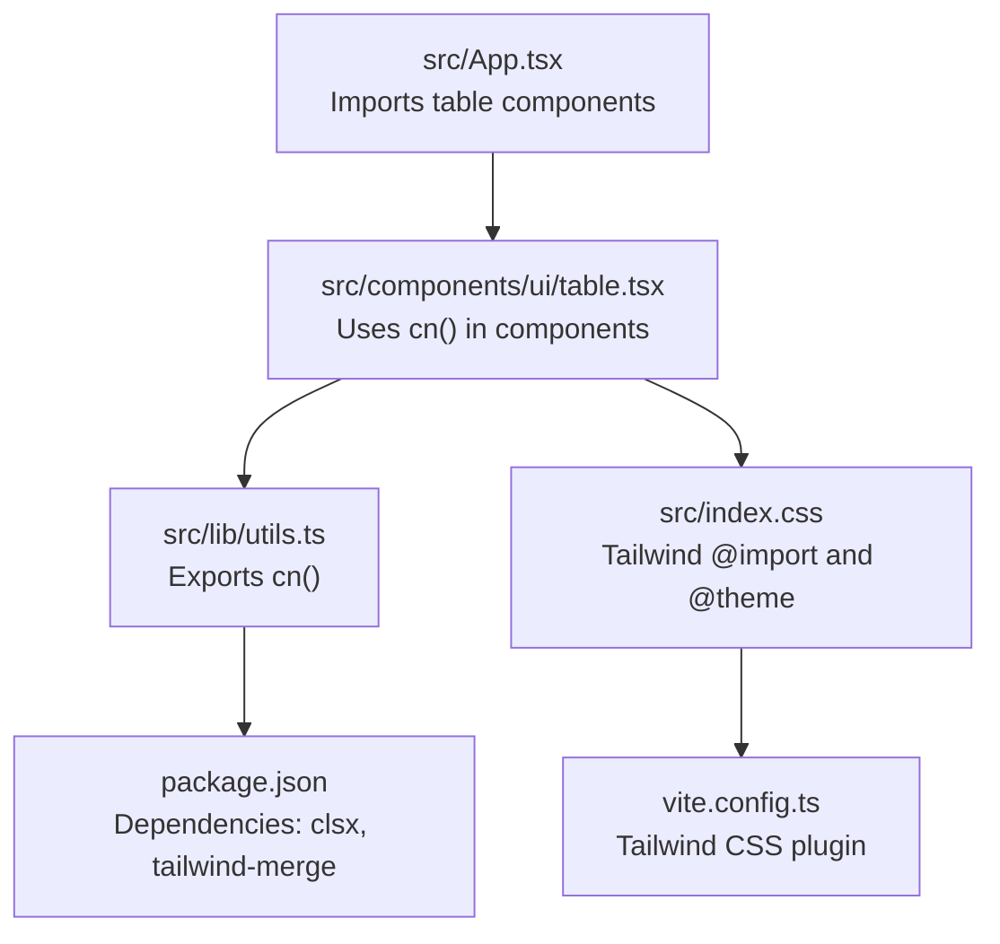
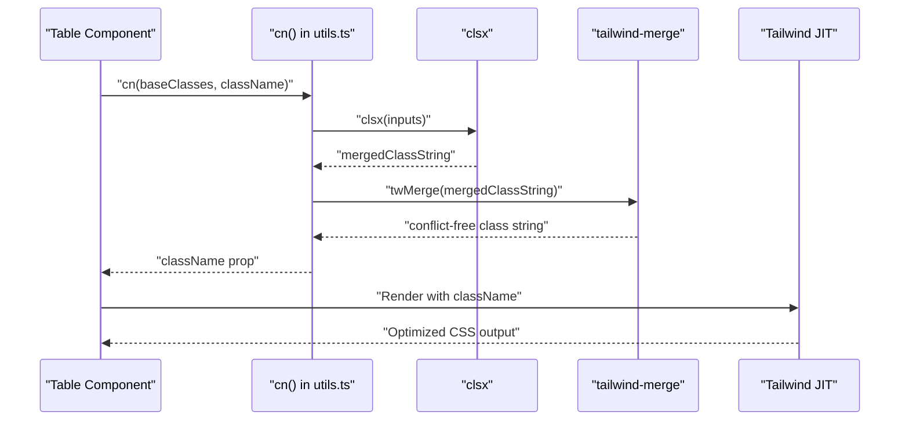
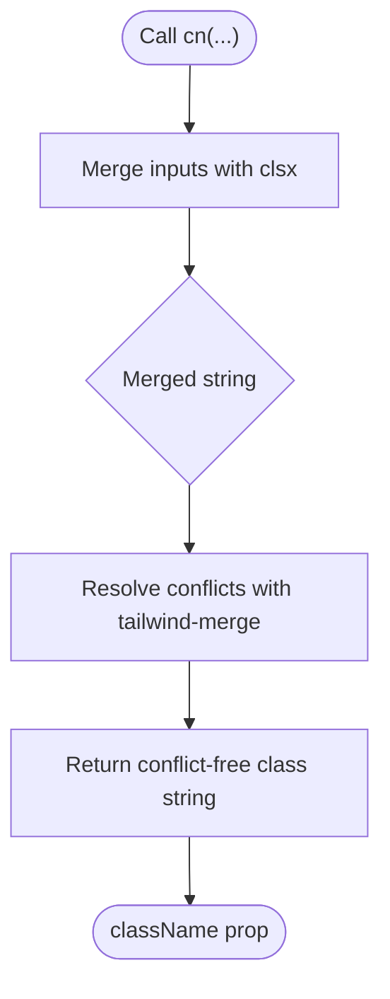
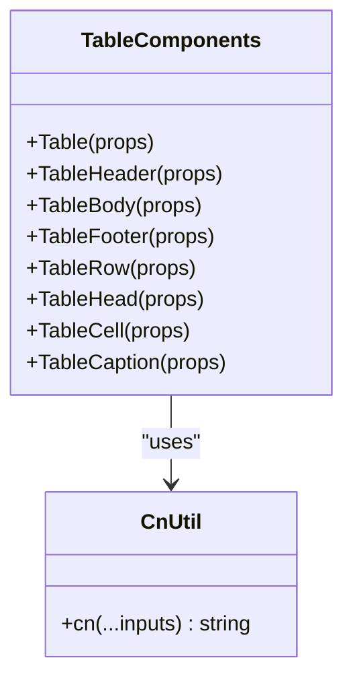
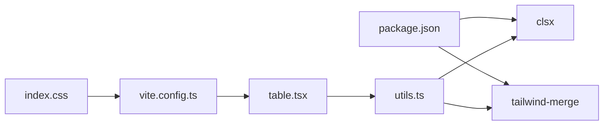

# Utility Systems

<cite>
**Referenced Files in This Document**
- [utils.ts](file://src/lib/utils.ts)
- [table.tsx](file://src/components/ui/table.tsx)
- [App.tsx](file://src/App.tsx)
- [index.css](file://src/index.css)
- [vite.config.ts](file://vite.config.ts)
- [package.json](file://package.json)
</cite>

## Table of Contents
1. [Introduction](#introduction)
2. [Project Structure](#project-structure)
3. [Core Components](#core-components)
4. [Architecture Overview](#architecture-overview)
5. [Detailed Component Analysis](#detailed-component-analysis)
6. [Dependency Analysis](#dependency-analysis)
7. [Performance Considerations](#performance-considerations)
8. [Troubleshooting Guide](#troubleshooting-guide)
9. [Conclusion](#conclusion)
10. [Appendices](#appendices)

## Introduction
This document focuses on the utility systems centered around the cn() function and class merging utilities. It explains how cn() combines Tailwind CSS classes using clsx and tailwind-merge for conflict resolution, documents its role in the component system, highlights performance benefits, and demonstrates usage patterns across the table components. It also covers integration with Tailwind CSS JIT compilation, best practices for extending the utility system, and guidelines for component styling.

## Project Structure
The utility system is implemented as a small, reusable function located under src/lib/utils.ts. The table components in src/components/ui/table.tsx consume this utility to merge static and dynamic Tailwind classes cleanly. The project integrates Tailwind CSS via the @tailwindcss/vite plugin and defines a custom theme in src/index.css.

**Diagram sources**
- [utils.ts:1-7](file://src/lib/utils.ts#L1-L7)
- [table.tsx:1-133](file://src/components/ui/table.tsx#L1-L133)
- [App.tsx:1-102](file://src/App.tsx#L1-L102)
- [index.css:1-40](file://src/index.css#L1-L40)
- [vite.config.ts:1-15](file://vite.config.ts#L1-L15)
- [package.json:12-20](file://package.json#L12-L20)

**Section sources**
- [utils.ts:1-7](file://src/lib/utils.ts#L1-L7)
- [table.tsx:1-133](file://src/components/ui/table.tsx#L1-L133)
- [App.tsx:1-102](file://src/App.tsx#L1-L102)
- [index.css:1-40](file://src/index.css#L1-L40)
- [vite.config.ts:1-15](file://vite.config.ts#L1-L15)
- [package.json:12-20](file://package.json#L12-L20)

## Core Components
- cn() function: A thin wrapper combining clsx and tailwind-merge to produce a single, conflict-free Tailwind class string. It accepts a variadic list of inputs compatible with ClassValue and returns a merged string.
- Table components: Each component in table.tsx uses cn() to merge base styles with incoming className props, enabling predictable composition and theme customization.

Key characteristics:
- Type-safe inputs via ClassValue union.
- Conflict resolution handled by tailwind-merge to prevent last-class wins from overriding conflicting utilities.
- Lightweight and composable across components.

**Section sources**
- [utils.ts:4-6](file://src/lib/utils.ts#L4-L6)
- [table.tsx:10-14](file://src/components/ui/table.tsx#L10-L14)
- [table.tsx:27-31](file://src/components/ui/table.tsx#L27-L31)
- [table.tsx:43-47](file://src/components/ui/table.tsx#L43-L47)
- [table.tsx:59-63](file://src/components/ui/table.tsx#L59-L63)
- [table.tsx:75-79](file://src/components/ui/table.tsx#L75-L79)
- [table.tsx:91-95](file://src/components/ui/table.tsx#L91-L95)
- [table.tsx:107-111](file://src/components/ui/table.tsx#L107-L111)
- [table.tsx:123-127](file://src/components/ui/table.tsx#L123-L127)

## Architecture Overview
The cn() utility sits at the intersection of component styling and Tailwind CSS JIT compilation. Components pass Tailwind utilities to cn(), which merges them with clsx and resolves conflicts with tailwind-merge. Tailwind’s JIT engine processes the resulting class string during build, producing optimized CSS.

**Diagram sources**
- [utils.ts:4-6](file://src/lib/utils.ts#L4-L6)
- [table.tsx:10-14](file://src/components/ui/table.tsx#L10-L14)
- [table.tsx:27-31](file://src/components/ui/table.tsx#L27-L31)
- [table.tsx:43-47](file://src/components/ui/table.tsx#L43-L47)
- [table.tsx:59-63](file://src/components/ui/table.tsx#L59-L63)
- [table.tsx:75-79](file://src/components/ui/table.tsx#L75-L79)
- [table.tsx:91-95](file://src/components/ui/table.tsx#L91-L95)
- [table.tsx:107-111](file://src/components/ui/table.tsx#L107-L111)
- [table.tsx:123-127](file://src/components/ui/table.tsx#L123-L127)

## Detailed Component Analysis

### cn() Function Implementation
The cn() function is a single-purpose utility that:
- Accepts a spread of inputs compatible with ClassValue.
- Delegates merging to clsx for logical combination.
- Resolves Tailwind conflicts via tailwind-merge to ensure only one variant of each utility class remains.

**Diagram sources**
- [utils.ts:4-6](file://src/lib/utils.ts#L4-L6)

**Section sources**
- [utils.ts:1-7](file://src/lib/utils.ts#L1-L7)

### Table Components and cn() Usage Patterns
Each table component composes a base set of Tailwind classes with an optional className prop using cn(). This pattern enables:
- Consistent base styling across components.
- Easy overrides and theme customization via className.
- Predictable class ordering and conflict-free outcomes.

Representative usage patterns across components:
- Table container and table element: merges base layout and typography classes with incoming className.
- TableHeader, TableBody, TableFooter: merges structural and responsive variants with className.
- TableRow, TableHead, TableCell, TableCaption: merges stateful and contextual styles with className.

**Diagram sources**
- [utils.ts:4-6](file://src/lib/utils.ts#L4-L6)
- [table.tsx:4-20](file://src/components/ui/table.tsx#L4-L20)
- [table.tsx:22-36](file://src/components/ui/table.tsx#L22-L36)
- [table.tsx:38-52](file://src/components/ui/table.tsx#L38-L52)
- [table.tsx:54-68](file://src/components/ui/table.tsx#L54-L68)
- [table.tsx:70-84](file://src/components/ui/table.tsx#L70-L84)
- [table.tsx:86-100](file://src/components/ui/table.tsx#L86-L100)
- [table.tsx:102-116](file://src/components/ui/table.tsx#L102-L116)
- [table.tsx:118-132](file://src/components/ui/table.tsx#L118-L132)

**Section sources**
- [table.tsx:10-14](file://src/components/ui/table.tsx#L10-L14)
- [table.tsx:27-31](file://src/components/ui/table.tsx#L27-L31)
- [table.tsx:43-47](file://src/components/ui/table.tsx#L43-L47)
- [table.tsx:59-63](file://src/components/ui/table.tsx#L59-L63)
- [table.tsx:75-79](file://src/components/ui/table.tsx#L75-L79)
- [table.tsx:91-95](file://src/components/ui/table.tsx#L91-L95)
- [table.tsx:107-111](file://src/components/ui/table.tsx#L107-L111)
- [table.tsx:123-127](file://src/components/ui/table.tsx#L123-L127)

### Practical Usage Scenarios
- Dynamic styling: Pass runtime values to className to adjust colors, spacing, or states.
- Conditional classes: Combine ternary or boolean logic with base classes to toggle variants.
- Theme customization: Override defaults by supplying className with theme-specific Tailwind utilities.

Examples in the app:
- TableHead receives a width class via className to control column sizing.
- TableBody rows apply hover and selected states conditionally.

**Section sources**
- [App.tsx:55-57](file://src/App.tsx#L55-L57)
- [App.tsx:83-94](file://src/App.tsx#L83-L94)

## Dependency Analysis
The cn() utility depends on clsx and tailwind-merge. The table components depend on cn() for class merging. Tailwind CSS is integrated via the @tailwindcss/vite plugin and configured through src/index.css.

**Diagram sources**
- [package.json:12-20](file://package.json#L12-L20)
- [utils.ts:1-2](file://src/lib/utils.ts#L1-L2)
- [table.tsx:1](file://src/components/ui/table.tsx#L1)
- [index.css:1](file://src/index.css#L1)
- [vite.config.ts:3](file://vite.config.ts#L3)

**Section sources**
- [package.json:12-20](file://package.json#L12-L20)
- [utils.ts:1-7](file://src/lib/utils.ts#L1-L7)
- [table.tsx:1](file://src/components/ui/table.tsx#L1)
- [index.css:1](file://src/index.css#L1)
- [vite.config.ts:3](file://vite.config.ts#L3)

## Performance Considerations
- Class merging cost: cn() performs two passes—clsx merging and tailwind-merge conflict resolution—adding negligible overhead compared to the build-time benefits.
- Tailwind JIT: Tailwind CSS compiles only the classes used in the final bundle, reducing CSS size and improving runtime performance.
- Predictable class order: Using cn() ensures consistent class ordering, minimizing reflows and repaints caused by conflicting utilities.

[No sources needed since this section provides general guidance]

## Troubleshooting Guide
Common issues and resolutions:
- Unexpected class overrides: Verify that className is passed after base classes so that tailwind-merge can resolve conflicts correctly.
- Conflicting utilities: Prefer mutually exclusive utilities (e.g., different text colors) and rely on tailwind-merge to keep the last variant.
- Build-time CSS not generated: Ensure Tailwind CSS is imported and the @tailwind directives are present in index.css and the Vite plugin is configured.

**Section sources**
- [utils.ts:4-6](file://src/lib/utils.ts#L4-L6)
- [index.css:1](file://src/index.css#L1)
- [vite.config.ts:3](file://vite.config.ts#L3)

## Conclusion
The cn() utility provides a robust, type-safe mechanism for merging Tailwind classes across components. By combining clsx and tailwind-merge, it ensures conflict-free class combinations while maintaining simplicity and composability. Integrated with Tailwind CSS JIT via the Vite plugin and a custom theme, the utility system delivers predictable styling, easy customization, and strong performance characteristics.

[No sources needed since this section summarizes without analyzing specific files]

## Appendices

### Best Practices for Extending the Utility System
- Keep cn() centralized: Place all class-merging logic in utils.ts to ensure consistency.
- Favor specificity over mutation: Use className to refine base styles rather than duplicating base classes.
- Leverage data attributes: Use data-slot and data-state selectors to scope styles and avoid global conflicts.
- Test with real-world scenarios: Validate class combinations under various conditions (hover, focus, selected states).

[No sources needed since this section provides general guidance]

### Guidelines for Component Styling
- Define base styles in components: Provide sensible defaults for layout, typography, and states.
- Allow overrides via className: Expose className props to enable theme customization.
- Use data-* attributes: Employ data-slot and data-state to target nested elements and states.
- Keep variants explicit: Prefer clear, descriptive class names and avoid implicit overrides.

[No sources needed since this section provides general guidance]